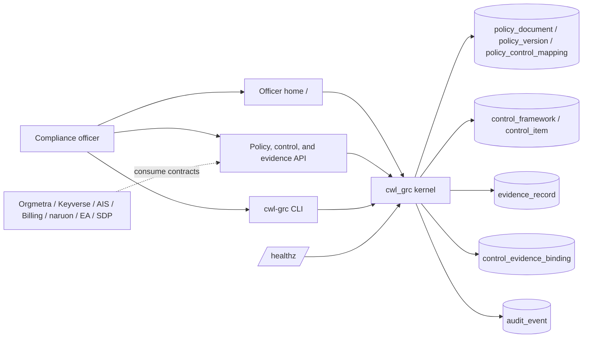

# ARCHITECTURE.md

## Architecture thesis

CWL GRC is a modular microservice that must run alone or be imported as `cwl_grc`. This slice owns versioned policies, the official control catalog, evidence artifacts, control–evidence bindings, and uncovered policy/control queries.

## Runtime layers

1. **Officer home**: buyer HTML that authors a policy, lists policy gaps, and attaches the next evidence.
2. **HTTP API**: policy author/revise/list, policy-gap query, catalog list, uncovered query, evidence create, evidence bind, `/healthz`.
3. **CLI tools**: `cwl-grc policy`, `cwl-grc gaps`, `cwl-grc bind`, and `cwl-grc serve`.
4. **Kernel package**: `create_app()` for modular composition; `python -m cwl_grc` for standalone HTTP.
5. **Store**: 3NF SQLite by default, PostgreSQL-ready URL via `CWL_GRC_DATABASE_URL`.

## Data ownership

| Object | Role |
| --- | --- |
| `policy_document` | Stable policy identity and title |
| `policy_version` | Immutable edition (body + author + version number) |
| `policy_control_mapping` | Edition → official `control_item` only |
| `control_framework` | One official catalog edition |
| `control_item` | One official identifier and statement |
| `authorization_purpose` | Declared purposes that may touch policy or evidence |
| `evidence_record` | Encrypted-at-rest artifact; plaintext is usable PII for authorized officers |
| `control_evidence_binding` | Many-to-many bind of artifact to control |
| `audit_event` | Append-only action record |

A policy gap is a latest-edition mapping whose control has zero `control_evidence_binding` rows. There is no second evidence-binding table.

Cross-service reads use the published HTTP contracts. Peer products do not query these tables.

## Security posture

Policy author/revise requires `X-Actor-Id` and `X-Purpose: policy_authoring`. Evidence create/bind requires `evidence_binding`. Catalog text is public. Payloads are Fernet-encrypted at rest and returned unmasked to the authorized purpose. SAST remains a CWL Security lane. OPA/Rego is not part of this kernel.

## Service extraction

The kernel is already a separately importable package. Extracting the process onto its own host must not change `/healthz`, `/policy-documents`, `/policy-gaps`, `/controls`, `/controls/uncovered`, or the evidence bind contract.
