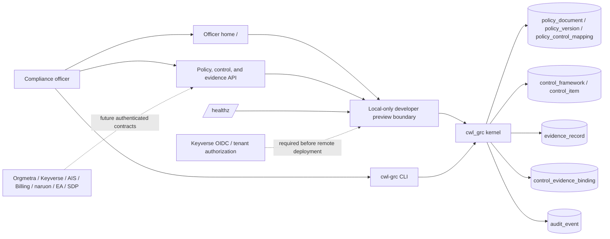

# ARCHITECTURE.md

## Architecture thesis

CWL GRC is a modular microservice that must run alone or be imported as `cwl_grc`. This slice owns versioned policies, the official control catalog, evidence artifacts, control–evidence bindings, and uncovered policy/control queries.

## Runtime layers

1. **Officer home**: buyer-oriented HTML that authors a policy, lists policy gaps, and attaches the next evidence in a local preview.
2. **HTTP API**: policy author/revise/list, policy-gap query, catalog list, uncovered query, evidence create, evidence bind, `/healthz`.
3. **Preview network boundary**: rejects proxy-forwarded and non-loopback traffic unless an operator deliberately enables the unsafe remote-preview escape hatch.
4. **CLI tools**: `cwl-grc policy`, `cwl-grc gaps`, `cwl-grc bind`, and `cwl-grc serve`.
5. **Kernel package**: `create_app()` for modular composition; `python -m cwl_grc` for standalone HTTP.
6. **Store**: 3NF SQLite by default, PostgreSQL-ready URL via `CWL_GRC_DATABASE_URL`.

## Data ownership

| Object | Role |
| --- | --- |
| `policy_document` | Stable policy identity and title |
| `policy_version` | Immutable edition (body + author + version number) |
| `policy_control_mapping` | Edition → official `control_item` only |
| `control_framework` | One official catalog edition |
| `control_item` | One official identifier and statement |
| `authorization_purpose` | Declared purpose attached to policy or evidence work; not actor authentication |
| `evidence_record` | Encrypted-at-rest artifact; exact values remain usable in an authorized workflow |
| `control_evidence_binding` | Many-to-many bind of artifact to control |
| `audit_event` | Append-only action record |

A policy gap is a latest-edition mapping whose control has zero `control_evidence_binding` rows. There is no second evidence-binding table.

Cross-service reads use published HTTP contracts after an authenticated service boundary exists. Peer products do not query these tables.

## Security posture

The current HTTP surface is an unauthenticated developer preview. `X-Actor-Id` and `X-Purpose` are audit and purpose declarations, not proof of identity. The application therefore denies non-loopback or proxy-forwarded traffic by default. `CWL_GRC_ALLOW_UNAUTHENTICATED_REMOTE_PREVIEW=1` is an explicit unsafe test-only override; it does not make the deployment production-ready.

Production exposure requires Keyverse-backed OIDC signature, issuer, audience, tenant, actor, and purpose authorization, plus encrypted transport and deployment controls. Evidence payloads remain encrypted at rest. The product does not destructively mask operational evidence; authenticated views and exports must select only the fields required for the approved purpose and omit unrelated fields. SAST remains a CWL Security lane. OPA/Rego is not part of this kernel.

## Service extraction

The kernel is already a separately importable package. Extracting the process onto its own host must preserve `/healthz`, `/policy-documents`, `/policy-gaps`, `/controls`, `/controls/uncovered`, and the evidence bind contract while replacing the preview boundary with the authenticated Keyverse and tenant-authorization adapter.
