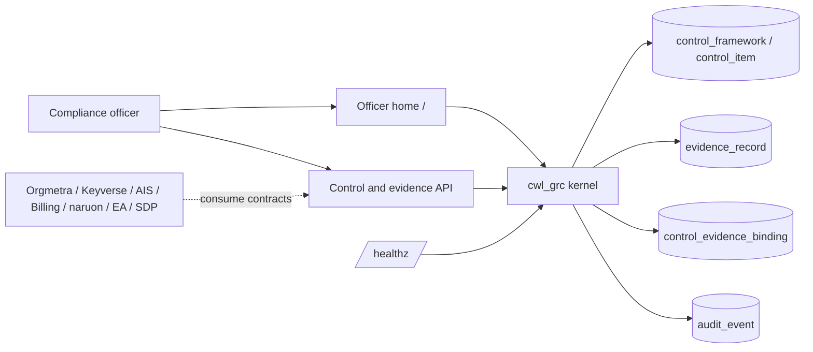

# ARCHITECTURE.md

## Architecture thesis

CWL GRC is a modular microservice that must run alone or be imported as `cwl_grc`. This first slice owns the control catalog, evidence artifacts, control–evidence bindings, and the uncovered-control query.

## Runtime layers

1. **Officer home**: buyer HTML that lists CSAP / SOC 2 / ISMS-P gaps and attaches the next evidence.
2. **HTTP API**: catalog list, uncovered query, evidence create, evidence bind, `/healthz`.
3. **Kernel package**: `create_app()` for modular composition; `python -m cwl_grc` for standalone.
4. **Store**: 3NF SQLite by default, PostgreSQL-ready URL via `CWL_GRC_DATABASE_URL`.

## Data ownership

| Object | Role |
| --- | --- |
| `control_framework` | One official catalog edition |
| `control_item` | One official identifier and statement |
| `authorization_purpose` | Declared purposes that may touch evidence |
| `evidence_record` | Encrypted-at-rest artifact; plaintext is usable PII for authorized officers |
| `control_evidence_binding` | Many-to-many bind of artifact to control |
| `audit_event` | Append-only action record |

Cross-service reads use the published HTTP contracts. Peer products do not query these tables.

## Security posture

Evidence create/bind requires `X-Actor-Id` and `X-Purpose: evidence_binding`. Catalog text is public. Payloads are Fernet-encrypted at rest and returned unmasked to the authorized purpose. SAST remains a CWL Security lane.

## Service extraction

The kernel is already a separately importable package. Extracting the process onto its own host must not change `/healthz`, `/controls`, `/controls/uncovered`, or the evidence bind contract.
