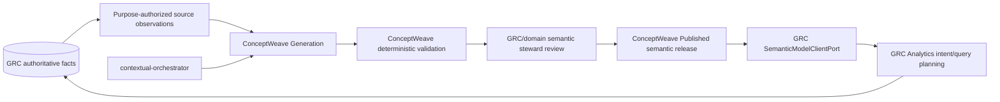

# ADR 0013 — Consume ConceptWeave semantic releases through a GRC Analytics client port

- **Status:** Proposed on stacked PR #64; not protected-`develop` truth until integrated.
- **Date:** 2026-09-01
- **Owners:** GRC Analytics (consumer policy) and ConceptWeave (semantic-model engineering contract)
- **Related:** GRC #63, GRC PR #62, ConceptWeave #2, ConceptWeave #3, ConceptWeave PR #5

## Context

GRC Analytics needs ontology and semantic-layer resolution before it can answer buyer questions systematically. Implementing ontology learning, ontology matching, semantic-release lifecycle, or LLM provider integration directly in GRC would duplicate ConceptWeave and mix two different bounded-context responsibilities.

GRC is authoritative for policy, obligation, control, implementation, evidence, test, risk, audit, finding, remediation, exception, tenant/purpose authorization, and deterministic GRC measures. ConceptWeave is responsible for observing source structures, proposing semantic concepts/relations/mappings/measures, validating semantic models, governing their publication lifecycle, and publishing versioned client contracts. `contextual-orchestrator` remains the sole production LLM/provider boundary.

## Decision

GRC Analytics consumes ConceptWeave through a provider-neutral `SemanticModelClientPort` in the Analytics **application** layer. GRC does not import ConceptWeave generator internals, prompts, provider DTOs, credentials, or persistence models.

The first consumer invariant is deliberately fail-closed: authoritative GRC semantic analysis may consume only a `Published` semantic release with a non-empty release identifier, a non-empty schema-version coordinate, and an immutable lowercase SHA-256 content coordinate. The GRC consumer additionally caps each release identifier and schema-version coordinate at 1024 characters **before** whitespace normalization. That cap is an operational input-safety bound owned by GRC, not a guessed ConceptWeave wire-schema limit; a published supplier contract may impose a stricter supported shape later. Proposed or superseded releases are not authoritative input. Malformed or oversized release coordinates must fail with the typed GRC semantic-release validation error instead of leaking provider/library/runtime exception shapes or forcing unbounded string normalization. A later concrete adapter must additionally validate ConceptWeave's published schema/version support, provenance, compatibility, digest-to-content integrity, and any signature policy without weakening this invariant.

The port does not grant data access. Keyverse-backed tenant/workspace/purpose/resource authorization occurs independently, and a semantic release cannot widen the caller's GRC projection. ConceptWeave concept identifiers and physical mappings describe meaning over GRC-owned facts; they do not replace or mutate those facts.

## Context map

`LineageWeave` may contribute observed/inferred/proposed lineage evidence and SearXNG may discover external source candidates, but neither changes this authority boundary. External search snippets are never semantic or GRC truth by themselves.

## Consequences

- ConceptWeave can evolve its generation algorithms and LLM prompts without forcing GRC to import generator internals.
- GRC becomes a reference client that exercises release compatibility, provenance, matching/resolution, query planning, and degraded-mode semantics.
- GRC can validate a release offline; routine use does not require an LLM call.
- Optional LLM-assisted matching/query interpretation must be invoked through ConceptWeave/contextual-orchestrator contracts and remains proposed evidence.
- A ConceptWeave outage or incompatible release degrades semantic analysis, not authoritative GRC write transactions.
- Cross-service application-table SQL is prohibited in both directions.

## Rejected alternatives

1. **Build a GRC-local ontology generator.** Rejected because it duplicates ConceptWeave and creates divergent semantic truth.
2. **Let GRC import ConceptWeave generator classes directly.** Rejected because it couples GRC to implementation details instead of a published release/client contract.
3. **Treat an LLM-generated ontology as authoritative immediately.** Rejected because model output remains inferred/proposed until deterministic validation and authorized review.
4. **Use vector similarity or Naive RAG as the semantic layer.** Rejected because retrieval similarity does not define ontology identity, authority, measure semantics, or compliance truth.

## Verification

PR #64 uses TDD. Its initial test-only RED head `15162eb4d8bca7fcbe8249524b47c7f6b6729b8a` failed because `cwl_grc.analytics.application.semantic_model` did not exist; the subsequent implementation established the provider-neutral port and publication/digest invariants.

A second test-first repair exercised the degraded-mode malformed-release boundary. Exact RED head `994b7d99627b49391f6a36790fe2ea39d01ab48a` ran in Product `33490857219` / job `99801746540`: lint and docstrings passed before tests/coverage failed because a non-string digest escaped as a raw Python error. Exact source-fix head `e7a97bd406ad97db4a36f6a1746e6bbc6b288374` passed Product `33491038085` / job `99802333337`, including exact-source verification, Ruff, docstrings, tests/coverage, compile, lock freshness, and clean-tree verification.

A third test-first repair closed incomplete release identity/version coordinates. Test-only exact head `5c78844f784cf87f8ec000bdcc9927fa26530923` ran in Product `33495770373` / job `99817487833`: exact-source verification, Ruff, and docstrings passed, then pytest failed on all six empty, whitespace-only, and non-string `release_id` / `schema_version` cases because the boundary did not raise `SemanticReleaseValidationError`. Minimal source-fix head `7f617feb8da8c5c5066eaf2027bbfae678eb2664` passed Product `33495993046` / job `99818202657`, including exact-source verification, runner hardening, hash-locked install, Ruff, docstrings, tests/branch coverage, compile, lock freshness, and clean-tree verification.

The resource-boundary defect was also specified RED-first. Test-only exact head `f1751a97873691beb24419224bef8182521e0755` added 1025-character release-identifier and schema-version cases; Product `33541318575` / job `99967978864` verified the exact checkout, passed lint and docstrings, then failed tests/coverage because both oversized coordinates were still accepted. Minimal source-fix head `966762af502365b3a230597c04ac12dc1928ab3e` rejects coordinates above 1024 characters before `.strip()` and passed exact-head Product `33541503511`, including the repository's full test/coverage, compile, lock-freshness, and clean-tree gate.

Documentation-only commits after a source-fix head require their own exact-head hosted revalidation; predecessor success is traceability evidence only.

The concrete ConceptWeave adapter is intentionally deferred until the generic Client/release contract tracked by ConceptWeave #3 and current Draft PR #5 is protected and released. GRC must not invent an endpoint or wire schema first.
