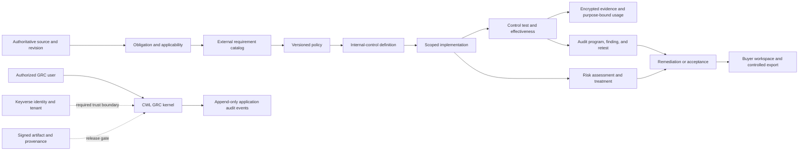

# Product and technical gap baseline

Snapshot (document generation date): 2026-08-21, Asia/Seoul
Repository: `ContextualWisdomLab/governance-risk-compliance`  
Baseline parent branch head: `de571802239ba819b0fd5201993f2e20ddad5645` (PR #19)
Baseline source head: `55afaee88fd0e9113a9fb655da1d2d95275c0e8c` (PR #33 exact head)
Develop-based buyer-workspace head: `30db69b4bf0ef39654cfaba460c7d4ba66ecc91d`
Active reviewed security/model/catalog/obligation fix heads: PR #32 `c750cb8bdc347f4fc592e2e908f098520e16074f`, PR #33 `55afaee88fd0e9113a9fb655da1d2d95275c0e8c`, PR #37 `3f08db7fa7d67cb44515784bc5b331fe0d21f457`, PR #38 `0c4084705b4f86913acdefa1ada3d17aa2d1e6f7`, PR #40 `4daab149d364f6117e31df22e14e11ad35d230b2`, PR #41 `b855456e150c4aefc2434ccfdf43d77f387aa204`, PR #42 `57b8ae066a27a163f6c299ee04d0c2ab19532a4a`, and PR #43 `f41c387c62998de2d136ce8f4a110b4cb22906ac`. This baseline follow-up is PR #39.
Active Keyverse stack heads: PR #6 `b9b3d5c49367d0b128c87aa478d8921eb1f6c349`, PR #7 `174b83691b103a42607ec33ca5fc7225216744b6`, and PR #16 `d7f867f2d55b21e04f548446c4148c1fdfa7474a`, stacked on PR #38 in that order.
Active evidence-lifecycle stack heads: PR #20 `e91b2384177451ebf80858e518d729e258c40f00` and PR #21 `0d7038da6d6ac8c365f5ef2420ccd054182cfedb`, stacked on PR #16 in that order.
Active operations stack heads: PR #22 `d3f3e51570870d12d641c9d2d73003995506427a`, PR #23 `cefdb021a35b77b053aaf111118f31db2ad17bd4`, PR #24 `52e590c6492d899697f67d13f85b7debdc56c9a5`, PR #25 `448456c3ec7d2126cd5c3fa5215ecde7dd013ffe`, PR #26 `56370ed9abf6464e32f56dbcf464edfb1fd7c915`, and PR #31 `2a14e9f0a91861df7bcdbbcec859bd19b996d358`, stacked on PR #21 in that order.

This document is the current product and technical truth baseline. It separates
observed runtime or GitHub evidence from inferred gaps and proposed acceptance
work. A green local test run, a merged pull request, a catalog mapping, or a
readiness manifest is not a production or compliance certification.

The active repository ruleset `18156473` requires two approving reviews,
approval of the last pushed commit, resolved review threads, and the central
required workflows before a protected merge.

## Executive outcome

The repository has a credible first buyer slice: an officer can author an
immutable, versioned policy, map it to seeded official external-requirement
identifiers, attach encrypted evidence, and query a preliminary uncovered list.
The product is not ready for remote customer use because identity, tenant
authorization, key recovery, release provenance, operational telemetry, and
stable production contracts remain incomplete.

The first slice also stops before the central enterprise-GRC distinction between
an external requirement, an organization-designed internal control, one deployed
implementation, a control test, and an effectiveness conclusion. Directly
binding evidence to `control_item` can prove artifact presence but cannot prove
that a control was implemented or operated effectively.

PR #32 stages the Issue #27 product-model correction on top of PR #31. Its
current exact head `c750cb8bdc347f4fc592e2e908f098520e16074f` carries the latest
operating-result, owner-graph, migration-SAST, approved-exception, deterministic
ordering, bounded legacy-identifier, idempotent-backfill, inactive/incomplete
test projection, and time-frozen test fixes. The integrated local suite has 160 tests with 2,405 statements/576 branches and 100% statement/branch/docstring
coverage, Ruff, compile, lock, actionlint, and Semgrep zero findings. No
current-head PostgreSQL probe or predecessor hosted result is claimed;
terminal hosted checks, independent approval, and protected merge remain open.

PR #33 stages the Issue #28 obligation-applicability correction on top of PR
#32. Its current exact head `55afaee88fd0e9113a9fb655da1d2d95275c0e8c` is aligned
to PR #32's current head and includes migration SQL hardening, superseded
decision exclusion, and license-classification artifact enforcement. The
integrated local suite has 171 tests with 2,978 statements/666 branches and
100% statement/branch/docstring coverage, Ruff, compile, lock, actionlint, and
Semgrep zero findings. The predecessor PostgreSQL probe and hosted results do
not transfer after this parent/head rebuild; terminal hosted checks, two
approving reviews, last-push approval, and protected merge remain absent.

PR #34 stages the Issue #30 buyer-workspace design authority directly on
`develop`. Its exact head `30db69b4bf0ef39654cfaba460c7d4ba66ecc91d` records the
current NIST SP 800-53 Release 5.2.0 APA 7 reference, rendered Figma header and
content repair,
and the English/Korean i18n contract against the existing checked-in npm
lockfile/Node pin, Storybook build, and Chromium interaction evidence. The
current head has local Python 53-test 100% statement/branch coverage,
Interrogate 100% docstring coverage, Storybook 10.5.10 build, and three
Chromium interaction tests. Product #568 and Buyer Workspace #10 are successful
on this exact head; Analyze, Scorecard, Semgrep, Trivy, OSV, dependency review,
required workflow, and Strix checks are also terminal-success, while
`coverage-evidence` remains queued. The current-head Scorecard review thread
is resolved, but independent approval is absent. It remains Draft; the fixture
is not authentication, API, export, accessibility-certification, or deployment
evidence.

PR #36 was closed after its earlier base became empty; its historical merge
record is not current source or protected-merge evidence. PR #41 carries the
intended replacement review-fix delta on the current PR #32 head. Its exact
head `b855456e150c4aefc2434ccfdf43d77f387aa204` has local 165-test 100%
statement/branch/docstring evidence, actionlint, and Semgrep zero-findings
evidence. The new-head Product jobs are terminal success; SAST, Security,
Strix, and required review workflows remain queued. Independent formal
approval remains outstanding.

PR #42 stages the organization OpenTelemetry acceptance-evidence boundary on
the current PR #32 head. Its exact head
`57b8ae066a27a163f6c299ee04d0c2ab19532a4a` renumbers the decision record to
the sequential ADR 0012 after a current-head review finding and carries the
latest parent stack. The integrated 160-test head passes 2,405 statements/576
branches with 100% statement/branch/docstring coverage, Ruff, lock, compile,
actionlint, diff, and Semgrep zero-findings checks. New-head hosted checks and
independent formal approval remain outstanding.

PR #43 stages the repository-owned caller for the central hourly review-repair
workflow. Its exact head `f41c387c62998de2d136ce8f4a110b4cb22906ac` schedules
one dispatch per hour against `develop`, pins the central reusable workflow to
`55a8b576725451dfe0a21a57d36a2f1a41619b24`, grants only `contents: read` and
`id-token: write`, and passes no model or mutation secret. Local evidence is
48 passing tests with 100% statement/branch coverage, 100% docstring coverage,
Ruff, compile, lock, actionlint, and Semgrep zero blocking findings. The
organization allowlist now includes this public repository with `all`
visibility; that external setting is observed configuration, not merge or
approval evidence. PR #43 remains Draft with hosted checks queued and no
independent approval.

The Keyverse buyer-boundary stack has been reconstructed on the direct-to-
`develop` PR #38 replacement for closed PR #5. PR #6 exact head
`b9b3d5c49367d0b128c87aa478d8921eb1f6c349` is the bounded OIDC/JWKS loader
with 97 local tests and 100% statement/branch/docstring coverage; PR #7 exact
head `174b83691b103a42607ec33ca5fc7225216744b6` adds verified-principal route
enforcement with 110 tests and the same coverage; PR #16 exact head
`d7f867f2d55b21e04f548446c4148c1fdfa7474a` adds tenant record isolation with
120 tests and 100% coverage. PR #16 also replaces dynamic migration SQL with
static tenant-column statements; the exact integrated head passes targeted
migration tests and Semgrep with zero blocking findings. All three are
MERGEABLE but Draft and blocked by fresh hosted checks and independent review;
no parent check or approval evidence transfers.

PR #37 stages the Issue #29 catalog-provenance slice directly on `develop`.
Its current exact head `3f08db7fa7d67cb44515784bc5b331fe0d21f457` adds the
governed bounded published-release review list, metadata-only release detail
snapshot with explicit license/export policy flags and content-policy mapping,
and published-only metadata comparison after the server-owned source-host
boundary; the locked runtime includes `psycopg[binary]`, the local suite has
74 passing tests with 100% statement/branch/docstring coverage, Ruff, compile,
lock, actionlint, diff, and Semgrep zero-blocking evidence. A real PostgreSQL
18.6 probe verifies migration `0002_catalog_provenance`, five reviewed
content-policy pairs, and `/healthz` 200. Product is successful on this exact
head; CodeQL, SAST, Security, Strix, and required review workflows remain
queued.
It deliberately does not claim remote fetching, OSCAL/OLIR parsing,
requirement-level control diff, or `control_framework` publication; two
approving reviews and last-push approval remain outstanding.

PR #38 is the direct-to-`develop` replacement for closed PR #5. Its exact head
`0c4084705b4f86913acdefa1ada3d17aa2d1e6f7` adds an optional caller-owned,
atomic JTI replay guard while preserving reusable bearer-token semantics when
the guard is absent. It responds to the prior exact-head Strix MEDIUM replay
finding on PR #5. Existing exact-head Product #514, SAST #155, Security #155,
and Strix Security Scan and Devin Review are terminal-success; the current
OpenCode review is queued. It is Ready for the required two approving
reviews, remains unmerged, and has neither those approvals nor last-push approval.

PR #40 stages the Issue #30 workflow security correction on PR #34's buyer
workspace branch. Its exact head `4daab149d364f6117e31df22e14e11ad35d230b2`
contains a normal merge of current PR #34 and replaces `npm exec` with the
checked-in local Playwright binary so the browser install path cannot fetch an
unpinned runner package. Local `npm ci`, Storybook, Chromium install, and three
browser tests pass; Product #570, Scorecard, Semgrep, Trivy, OSV, dependency
review, and required workflow checks are terminal-success, while the current
OpenCode review is queued and independent approval is absent.

The next production action is to integrate one verified Keyverse tenant and
actor through the existing policy/evidence flow and prove that the same boundary
holds for every read, write, export, audit event, background job, and stored
relationship. The next product-model action is issue #27: establish internal
control, implementation, testing, effectiveness, deficiency, and evidence-usage
truth before risk and audit workflows depend on the current catalog model.

The complete domain sequence is defined in
[`docs/product/grc-domain-completion-roadmap.md`](product/grc-domain-completion-roadmap.md).

## Evidence convention

- **Observed** means reproduced from the current checkout or a current GitHub
  API/check result.
- **Inferred** means a gap derived from the mission, ADRs, issue contracts, or
  an ownership boundary; it still needs implementation proof.
- **Proposed** means the smallest acceptance slice intended to turn the gap into
  an observable product capability.

## Automation status

PR #43 now declares the repository-owned hourly caller on `develop`; the
privileged review/repair implementation remains centrally owned by
`.github`'s reusable workflow pinned to exact main commit
`55a8b576725451dfe0a21a57d36a2f1a41619b24`. The caller dispatches at minute 53,
allows one target dispatch, retries transient work for two hours, and has no
write permission or optional mutation secret. The organization variable
`OPENCODE_REPOSITORY_DISPATCH_TARGETS` has been observed to include
`ContextualWisdomLab/governance-risk-compliance` with `all` visibility. Hosted
execution, independent review, exact-head required checks, and protected merge
remain separate gates; no local schedule is evidence that those gates passed.

## Current product contract

| Capability | Observed implementation | Boundary that still matters |
| --- | --- | --- |
| Policy authoring | `policy_document`, immutable `policy_version`, and `policy_control_mapping`; HTTP and CLI paths exist. | No approval/publication workflow, effective period, scheduled review, or tenant-backed identity. |
| External-requirement catalogs | CSAP 2026.07, SOC 2 TSC, ISMS-P, ISO/IEC 27001:2022, NIST SP 800-53 Rev. 5, COSO 2013, and COSO 2017 identifiers are seeded. | The catalog is a small checked-in slice, not a licensed source-artifact ingestion, edition-diff, OSCAL, or OLIR service. |
| Requirement/control semantics | PR #32 stages separate objectives, versioned internal-control definitions, scoped implementations, reviewed mappings, design/operating tests, deficiencies, exceptions, and evidence usage; direct bindings project to `unassessed`. | PR #32 is stacked and unmerged; stable authenticated APIs, production identity, and downstream risk/audit consumers remain incomplete. |
| Compliance applicability | PR #33 stages tenant-scoped source revisions, obligations, jurisdictions, applicability decisions, commitments, regulatory changes, impact assessments, proposed-only requirement links, null-safe target uniqueness, and overdue/upcoming worklists; current-head local, PostgreSQL, and external-gate evidence is recorded above. | PR #33 is stacked and unmerged; production Keyverse authorization, stable versioned APIs, external source ingestion, independent approval workflow, and downstream risk/audit workflows remain incomplete. |
| Evidence | Evidence is encrypted at rest, exact operational values remain usable, and artifacts bind to catalog rows. | Rotation, KMS/HSM, recovery rehearsal, disposition, request/review workflow, purpose-specific exports, and tenant authorization are incomplete. |
| Gap query | PR #32 projects latest policy mappings and catalog rows through explicit control statuses; legacy direct bindings remain `unassessed`. | The feature is not merged, and risk priority, production ownership, authenticated APIs, and remediation workflows remain absent. |
| Integrity | SQLite/PostgreSQL triggers protect audit history and finalized policy history; stale policy writers receive `409 Conflict`. | PostgreSQL lifecycle work is in PR #18 and is not merged at this snapshot. |
| Runtime boundary | The HTTP server is loopback-only; `X-Actor-Id` and `X-Purpose` are explicitly non-authenticating declarations. | No production remote deployment is permitted until Keyverse identity, tenant authorization, and deployment hardening close the trust boundary. |
| Module boundary | `create_app()` and the `cwl_grc` package support standalone or imported use. | Authenticated versioned service contracts and cross-repository contract tests do not yet exist. |
| Quality | Product workflows require locked dependencies, lint, docstrings, compile, and 100% statement/branch coverage. | Passing quality gates proves code quality only for the tested scope; it does not establish product completeness, effectiveness, or certification. |

Authoritative first-slice decisions are in
[ADR 0001](adr/0001-control-evidence-first-slice.md) and
[ADR 0002](adr/0002-policy-versioning-official-controls.md). The product-model
separation is proposed in
[ADR 0011](adr/0011-separate-external-requirements-and-internal-controls.md).
The implementation remains a modular kernel, not a monolith that absorbs
identity, employment, architecture, data catalog, billing, communications, or
organization-wide security scanning.

## Buyer-visible gap register

`G-*` identifiers are product-analysis identifiers in this document. They are
not GitHub issue numbers, control identifiers, certifications, or release gates.
One implementation issue may address several gaps, and a gap may require several
issues and PRs.

| ID | Priority | Buyer-visible gap | Current evidence | Proposed acceptance slice | Authority |
| --- | --- | --- | --- | --- | --- |
| G-01 | P0 | A customer cannot safely use the product remotely because caller identity and tenant are not verified. | Local-only boundary in `cwl_grc/remote_access.py`; issue #4; closed PR #5 is superseded by direct-to-`develop` PR #38, while PRs #6, #7, and #16 remain staged Keyverse work. | Verify issuer, audience, token type, signature, actor, tenant, workspace, client, principal kind, role, purpose, and action scope on every protected read/write/export/background job. | [Issue #4](https://github.com/ContextualWisdomLab/governance-risk-compliance/issues/4) |
| G-02 | P0 | Operators can encounter ambiguous schema ownership or migration failure in durable PostgreSQL deployments. | PR #18 implements the first schema-lifecycle slice, including explicit ownership, compatibility checks, PostgreSQL acceptance, and review fixes. | Merge only after fresh exact-head Product, PostgreSQL, SAST, Security, semantic review, zero valid unresolved findings, and live branch-policy evidence. | [Issue #8](https://github.com/ContextualWisdomLab/governance-risk-compliance/issues/8) |
| G-03 | P0 | Loss, rotation, retention, legal hold, or recovery failure can make exact operational evidence unavailable or non-compliant. | PR #20 adds versioned key metadata and bounded rewrap; PR #21 adds retention and tenant-scoped legal-hold transitions. Both are stacked and unmerged. | Add production KMS/HSM, durable rewrap receipts, disposition, purpose-specific disclosure, encrypted backup, PITR, restore verification, RPO/RTO, and emergency read-only operation. | [Issue #9](https://github.com/ContextualWisdomLab/governance-risk-compliance/issues/9) |
| G-04 | P0 | A buyer cannot independently verify that a released artifact came from reviewed source or can be rolled back safely. | No signed production OCI/wheel release, artifact-bound SBOM/provenance, protected promotion, or revocation rehearsal is merged. | Build immutable signed artifacts, verify the exact security result, promote by digest, enforce rulesets, and rehearse install/upgrade/rollback/revocation. | [Issue #10](https://github.com/ContextualWisdomLab/governance-risk-compliance/issues/10) |
| G-05 | P0 | Operators lack merged readiness, telemetry, SLO, alerting, and incident evidence. | `develop` still exposes the first-slice constant `/healthz`; PRs #22–#26 and #31 stage readiness, request/database/pool/recovery telemetry and a proposed SLO policy, while PR #42 records the GRC-owned organization OpenTelemetry acceptance-evidence boundary without copying raw telemetry into GRC. | Complete collector delivery, recording rules, dashboards, burn-rate paging, recovery coordinator, service-owner approval, rollback/restore rehearsal, and production integration evidence. | [Issue #11](https://github.com/ContextualWisdomLab/governance-risk-compliance/issues/11) |
| G-06 | P1 | Consumers cannot safely depend on a stable production API or bounded resource behavior. | Routes are unversioned, broad dictionaries remain, list APIs are unpaginated, mutations lack a complete idempotency contract, and errors are endpoint-specific. | Add `/v1`, strict models, cursor pagination, idempotency, ETags/preconditions, RFC 9457 errors, bounded media/size/time/concurrency, OpenAPI security, fuzz/property and consumer-contract tests. | [Issue #12](https://github.com/ContextualWisdomLab/governance-risk-compliance/issues/12) |
| G-07 | P1 | The product cannot register, assess, treat, accept, monitor, and close risk through reviewed control-effectiveness truth. | No risk register or methodology exists; issue #13 now explicitly depends on internal-control implementation and test truth from #27. | Add immutable methodology-versioned inherent/residual assessments, appetite/tolerance, treatment, time-bounded acceptance, reviews, indicators, escalation, and non-duplicated mitigation. | [Issue #13](https://github.com/ContextualWisdomLab/governance-risk-compliance/issues/13) |
| G-08 | P1 | An auditor cannot run a complete governed audit from program planning through independent closure. | Evidence and `audit_event` exist, but audit universe, program, engagement, procedures, sampling, workpapers, findings, competence, independence, supervision, remediation, retest, closure, and quality assessment do not. | Implement the ISO 19011:2026 and IIA-aligned workflow against actual internal-control implementations and purpose-bound evidence usage. | [Issue #14](https://github.com/ContextualWisdomLab/governance-risk-compliance/issues/14) |
| G-09 | P0 | A green workflow can be mistaken for release authority without one exact machine-verifiable readiness decision. | PR #17 adds a fail-closed readiness manifest and repository-file evidence binding; it remains unmerged and intentionally reports `production_ready=false`. | Require exact current source/artifact evidence, freshness, branch policy, security gates, independent approval, and zero blockers before release mode succeeds. | [Issue #15](https://github.com/ContextualWisdomLab/governance-risk-compliance/issues/15) |
| G-10 | P1 | Catalog maintenance can drift, lose provenance, overstate mappings, or redistribute source text without authority. | Catalog rows are manually checked into `cwl_grc/catalog.py`; PR #37 now stages provenance metadata, source/version/import/receipt/release persistence, a governed release-review list, metadata-only release detail and published-only comparison, explicit content-policy mapping, reviewed APA references, a server-owned source-host boundary, and a locked PostgreSQL driver, but no remote fetch, OSCAL/OLIR parser, requirement-level diff, or `control_framework` publication is claimed. | Add lawful source-artifact ingestion, requirement-level versioned release/diff, export restrictions, OSCAL 1.2.3 Catalog/Profile/Mapping round trips, reviewed mapping semantics, OLIR provenance, and change impact. | [Issue #29](https://github.com/ContextualWisdomLab/governance-risk-compliance/issues/29) |
| G-11 | P1 | A buyer lacks a role-aware compliance workspace, evidence request room, external-auditor data room, and controlled export. | PR #34 exact head `30db69b4bf0ef39654cfaba460c7d4ba66ecc91d` adds Figma/Storybook authority, semantic design tokens, exact-value and next-action fixture states, lockfile/Node pinning, Chromium interaction evidence, rendered desktop-header/content and mobile layout repair, and a tested English/Korean i18n contract; PR #40 exact head `4daab149d364f6117e31df22e14e11ad35d230b2` stages the local pinned-Playwright correction. It remains a static local preview. | Deliver tenant- and purpose-scoped posture, traceability, real evidence requests, action queues, accessible exact-value views, reproducible CSV/JSON/PDF exports, i18n consistency, and expiring/revocable auditor packages. | [Issue #30](https://github.com/ContextualWisdomLab/governance-risk-compliance/issues/30) |
| G-12 | P1 | Cross-repository consumers cannot rely on a governed GRC contract. | Architecture names Keyverse, Orgmetra, AIS, Billing, naruon, EA, and Semantic Data Portal as future consumers or authorities only. | Publish minimal OpenAPI/event contracts, opaque references, purpose/tenant/provenance envelopes, contract tests, and explicit authoritative/observed/inferred/proposed boundaries. | [ARCHITECTURE.md](../ARCHITECTURE.md) |
| G-13 | P0 | External requirements, internal controls, implementations, tests, and evidence use are conflated. | PR #32 exact head `c750cb8bdc347f4fc592e2e908f098520e16074f` stages the separated model plus latest-result, owner-graph, approved-exception, migration-SAST, bounded-identifier, idempotent-backfill, inactive/incomplete-test projection, and operations-stack fixes; PR #41 exact head `b855456e150c4aefc2434ccfdf43d77f387aa204` is rebuilt on that parent with local actor-boundary, SAST, and time-frozen test fixes. PR #32 and PR #41 still lack independent approval and protected merge evidence. | Obtain terminal exact-head gates and independent approval for PR #32, merge it through branch protection, then revalidate and merge PR #41 before authenticated stable APIs and risk/audit consumers depend on the model. | [Issue #27](https://github.com/ContextualWisdomLab/governance-risk-compliance/issues/27) |
| G-14 | P1 | The product cannot prove which laws, regulations, contracts, and commitments apply to a precise tenant, scope, jurisdiction, and time. | PR #33 exact head `55afaee88fd0e9113a9fb655da1d2d95275c0e8c` stages source revisions, obligations, jurisdiction references, applicability decisions, legal interpretations, commitments, proposed-only requirement links, source changes, impact assessments, tenant checks, null-safe target uniqueness, immutable guards, supersession exclusion, and license-classification artifact enforcement. Its integrated local suite is green, but predecessor PostgreSQL/hosted evidence does not transfer and no protected merge is observed. | Complete the protected PR #32 → PR #33 merge sequence, then add production Keyverse authorization, independent approval workflow, lawful source-artifact ingestion/diff, stable authenticated APIs, and downstream risk/audit/workspace consumers. | [Issue #28](https://github.com/ContextualWisdomLab/governance-risk-compliance/issues/28) |

## Current open-issue snapshot

Snapshot inclusion rule: every GitHub issue returned as open for this repository
on 2026-08-21. Pull requests are excluded and listed separately below. All 13
entries were open at the snapshot; their state can change after this commit.

| Issue | Snapshot state | Primary gap / purpose |
| --- | --- | --- |
| [#4](https://github.com/ContextualWisdomLab/governance-risk-compliance/issues/4) | Open | G-01 — Keyverse identity and tenant authorization |
| [#8](https://github.com/ContextualWisdomLab/governance-risk-compliance/issues/8) | Open | G-02 — PostgreSQL schema lifecycle |
| [#9](https://github.com/ContextualWisdomLab/governance-risk-compliance/issues/9) | Open | G-03 — evidence key, retention, legal hold, and recovery |
| [#10](https://github.com/ContextualWisdomLab/governance-risk-compliance/issues/10) | Open | G-04 — signed release and protected promotion |
| [#11](https://github.com/ContextualWisdomLab/governance-risk-compliance/issues/11) | Open | G-05 — readiness, telemetry, SLO, and incident operations |
| [#12](https://github.com/ContextualWisdomLab/governance-risk-compliance/issues/12) | Open | G-06 — versioned API, concurrency, and abuse controls |
| [#13](https://github.com/ContextualWisdomLab/governance-risk-compliance/issues/13) | Open | G-07 — risk register, treatment, and acceptance |
| [#14](https://github.com/ContextualWisdomLab/governance-risk-compliance/issues/14) | Open | G-08 — audit program, findings, remediation, and closure |
| [#15](https://github.com/ContextualWisdomLab/governance-risk-compliance/issues/15) | Open | G-09 — machine-verifiable readiness evidence gate |
| [#27](https://github.com/ContextualWisdomLab/governance-risk-compliance/issues/27) | Open | G-13 — separate external requirements and internal controls |
| [#28](https://github.com/ContextualWisdomLab/governance-risk-compliance/issues/28) | Open | G-14 — obligation, applicability, and regulatory change |
| [#29](https://github.com/ContextualWisdomLab/governance-risk-compliance/issues/29) | Open | G-10 — catalog governance, OSCAL, and OLIR |
| [#30](https://github.com/ContextualWisdomLab/governance-risk-compliance/issues/30) | Open | G-11 — buyer workspace, evidence room, and exports |

## Current pull-request queue

Snapshot inclusion rule: every open pull request is listed. Rows without a date
marker use the full 40-character head SHA observed on 2026-08-20; PRs #6, #7,
#16, #18, #19, #32, #33, #37, #38, #40, #41, and #42 were rechecked or reconstructed on 2026-08-21
after their current-head or branch-boundary updates. PR #36 is closed with a
historical merge record, but its source is not treated as current evidence;
PR #41 carries the intended replacement delta. PR #39 uses its immutable
parent head because embedding its child head would change this document on
every edit. A later push makes a row stale and requires a new snapshot. No
self-approval, admin merge, force-push, or predecessor-head evidence is valid.

| PR | Exact head at snapshot | State | Current evidence/action |
| --- | --- | --- | --- |
| [#18](https://github.com/ContextualWisdomLab/governance-risk-compliance/pull/18) | `6715c42d9276b36e1f081850ba3b74413fbc8ccd` | Ready, merge-blocked, review-required | Exact-head local evidence is 110 passed and 23 skipped with 100% statement/branch coverage, Ruff, Interrogate, uv lock, actionlint, and Semgrep zero findings; hosted Product/readiness evidence is successful while security/review lanes remain pending. Two approving reviews and last-push approval remain required. |
| [#17](https://github.com/ContextualWisdomLab/governance-risk-compliance/pull/17) | `4a17369604affe8a2b595c22ed8414844f746ae2` | Ready, merge-blocked, review-required | Exact-head local evidence is 112 passed with 100% statement/branch coverage, Ruff, Interrogate, uv lock, actionlint, and Semgrep zero findings; hosted Product/readiness evidence is successful while security/review lanes remain pending. Keep the readiness result intentionally false until protected review completes. |
| [#20](https://github.com/ContextualWisdomLab/governance-risk-compliance/pull/20) | `e91b2384177451ebf80858e518d729e258c40f00` | Draft, merge-blocked, review-required | Versioned evidence keyring and bounded rewrap stacked on current PR #16 exact head `d7f867f2d55b21e04f548446c4148c1fdfa7474a`. The integrated exact head has 129 tests, 1,505 statements, 392 branches, 100% coverage/docstrings, full lint/compile/lock/actionlint, and Semgrep zero findings; hosted checks and independent approval remain absent. |
| [#21](https://github.com/ContextualWisdomLab/governance-risk-compliance/pull/21) | `0d7038da6d6ac8c365f5ef2420ccd054182cfedb` | Draft, merge-blocked, review-required | Retention and legal hold stacked on current PR #20 exact head `e91b2384177451ebf80858e518d729e258c40f00`. The integrated exact head has 132 tests, 1,591 statements, 422 branches, 100% coverage/docstrings, full lint/compile/lock/actionlint, and Semgrep zero findings; the predecessor PostgreSQL probe does not transfer, hosted checks and independent approval remain absent. |
| [#22](https://github.com/ContextualWisdomLab/governance-risk-compliance/pull/22) | `d3f3e51570870d12d641c9d2d73003995506427a` | Draft, merge-blocked, review-required | Operational readiness slice stacked on #21. The corrected exact head has 144 tests, 1,794 statements, 466 branches, 100% coverage/docstrings, full lint/compile/lock/actionlint, and Semgrep zero findings; hosted checks and independent approval remain required. |
| [#23](https://github.com/ContextualWisdomLab/governance-risk-compliance/pull/23) | `cefdb021a35b77b053aaf111118f31db2ad17bd4` | Draft, merge-blocked, review-required | Request telemetry stacked on #22. The corrected exact head has 147 tests, 1,866 statements, 472 branches, 100% coverage/docstrings, full lint/compile/lock/actionlint, and Semgrep zero findings; exception messages and stacktraces remain excluded from span events, while hosted checks and independent approval remain. |
| [#24](https://github.com/ContextualWisdomLab/governance-risk-compliance/pull/24) | `52e590c6492d899697f67d13f85b7debdc56c9a5` | Draft, merge-blocked, review-required | Database transaction telemetry stacked on #23. The corrected exact head has 149 tests, 1,892 statements, 476 branches, 100% coverage/docstrings, full lint/compile/lock/actionlint, and Semgrep zero findings; pool/recovery signals, collector acceptance, hosted checks, and independent approval remain. |
| [#25](https://github.com/ContextualWisdomLab/governance-risk-compliance/pull/25) | `448456c3ec7d2126cd5c3fa5215ecde7dd013ffe` | Draft, merge-blocked, review-required | Proposed SLO/error-budget policy stacked on #24. The corrected exact head has 149 tests, 1,892 statements, 476 branches, 100% coverage/docstrings, full lint/compile/lock/actionlint, and Semgrep zero findings; the operational runbook now includes the audit-write metric, while hosted checks and exact-head acceptance remain. |
| [#26](https://github.com/ContextualWisdomLab/governance-risk-compliance/pull/26) | `56370ed9abf6464e32f56dbcf464edfb1fd7c915` | Draft, merge-blocked, review-required | Bounded database-pool telemetry stacked on #25. The corrected exact head has 150 tests, 1,905 statements, 482 branches, 100% coverage/docstrings, full lint/compile/lock/actionlint, and Semgrep zero findings; database exporter wiring, dashboards, alert routing, hosted checks, and independent approval remain. |
| [#31](https://github.com/ContextualWisdomLab/governance-risk-compliance/pull/31) | `2a14e9f0a91861df7bcdbbcec859bd19b996d358` | Draft, merge-blocked, review-required | Recovery-event telemetry stacked on #26. The corrected exact head has 151 tests, 1,915 statements, 486 branches, 100% coverage/docstrings, full lint/compile/lock/actionlint, and Semgrep zero findings; recovery rehearsal, collector/dashboard wiring, alert routing, hosted checks, and production recovery evidence remain. |
| [#32](https://github.com/ContextualWisdomLab/governance-risk-compliance/pull/32) | `c750cb8bdc347f4fc592e2e908f098520e16074f` (2026-08-21) | Ready, merge-blocked, review-required | Internal-control model stacked on #31 for Issue #27. The corrected exact head has 160 tests, 2,405 statements, 576 branches, 100% coverage/docstrings, full lint/compile/lock/actionlint, and Semgrep zero findings; tenant-scoped coverage, legacy `unassessed` projection, and current-head review remain subject to hosted checks, two approvals, and last-push approval. |
| [#33](https://github.com/ContextualWisdomLab/governance-risk-compliance/pull/33) | `55afaee88fd0e9113a9fb655da1d2d95275c0e8c` (2026-08-21) | Ready, merge-blocked, review-required | Obligation applicability and regulatory-change model stacked on current PR #32 for Issue #28. The corrected exact head has 171 tests, 2,978 statements, 666 branches, 100% coverage/docstrings, full lint/compile/lock/actionlint, and Semgrep zero findings; the predecessor PostgreSQL probe/hosted results do not transfer and terminal checks, two approvals, last-push approval, and protected merge remain required. |
| [#34](https://github.com/ContextualWisdomLab/governance-risk-compliance/pull/34) | `30db69b4bf0ef39654cfaba460c7d4ba66ecc91d` | Draft, merge-blocked, review-required | Issue #30 buyer-workspace design authority on `develop`. The exact current head has local Python 53-test 100% statement/branch coverage, Interrogate 100% docstring coverage, Storybook 10.5.10 build, and three Chromium interaction tests including English/Korean switching and stable state identifiers. Hosted Product and buyer-workspace/security lanes are successful, while required review evidence and independent approval remain absent. |
| [#37](https://github.com/ContextualWisdomLab/governance-risk-compliance/pull/37) | `3f08db7fa7d67cb44515784bc5b331fe0d21f457` (2026-08-21) | Draft, merge-blocked, review-required | Issue #29 catalog-provenance slice on `develop`. Current head adds bounded published-only release listing, governed metadata-only detail with license/export policy flags, explicit content-policy mapping, immutable receipt metadata conflict checks, and normalized source URLs; the locked runtime includes `psycopg[binary]`, local 74-test 100% statement/branch/docstring, Ruff, compile, lock, actionlint, diff, and Semgrep zero-blocking evidence pass, plus a real PostgreSQL source/version/import/release workflow and idempotent second startup. New-head Product, CodeQL, SAST, Security, Strix, and required review workflows remain queued; scope excludes remote source retrieval, OSCAL/OLIR parsing, requirement-level control diff, and protected approvals. |
| [#38](https://github.com/ContextualWisdomLab/governance-risk-compliance/pull/38) | `0c4084705b4f86913acdefa1ada3d17aa2d1e6f7` | Ready, merge-blocked, review-required | Replacement for closed PR #5. The exact head adds an optional caller-owned atomic JTI replay guard; local 76-test 100% evidence and hosted Product/SAST/Security/Strix/coverage success are observed, while the current OpenCode review is queued and two approvals plus last-push approval remain outstanding. |
| [#39](https://github.com/ContextualWisdomLab/governance-risk-compliance/pull/39) | `632aac2770df7796aadc852dff327ed9e7ba1e4e` (2026-08-21) | Draft, merge-blocked, review-required | Current buyer-gap baseline follow-up targets `docs/product-technical-gap-baseline` at PR #19 exact head `de571802239ba819b0fd5201993f2e20ddad5645`. The corrected docs head records current Keyverse, evidence-lifecycle, operations, internal-control, obligation, catalog, buyer-workspace, automation, and observed-vs-inferred boundaries; it remains documentation evidence only. |
| [#40](https://github.com/ContextualWisdomLab/governance-risk-compliance/pull/40) | `4daab149d364f6117e31df22e14e11ad35d230b2` | Ready, merge-blocked, review-required | Scorecard pinned-dependencies fix for PR #34. A normal merge commit brings the current PR34 base into the child; the stacked diff remains one workflow-line change. Local Python 53-test/100% coverage, Interrogate 100%, Storybook, actionlint, and three browser tests pass; current OpenCode review is queued and independent approval is absent. |
| [#41](https://github.com/ContextualWisdomLab/governance-risk-compliance/pull/41) | `b855456e150c4aefc2434ccfdf43d77f387aa204` (2026-08-21) | Draft, merge-blocked, review-required | Replacement for closed PR #36 on current PR #32 head `c750cb8bdc347f4fc592e2e908f098520e16074f`. The branch carries the migration-SAST, local actor-boundary, and `grc.control.read` coverage fixes plus the parent review fixes. Local 165-test 100% statement/branch/docstring, full lint/compile/lock/actionlint/diff checks, and Semgrep zero-findings evidence pass; new-head Product and required security/review lanes are queued. |
| [#42](https://github.com/ContextualWisdomLab/governance-risk-compliance/pull/42) | `57b8ae066a27a163f6c299ee04d0c2ab19532a4a` (2026-08-21) | Ready, merge-blocked, review-required | Organization OpenTelemetry acceptance-evidence boundary on current PR #32 head `c750cb8bdc347f4fc592e2e908f098520e16074f`. The exact docs head fixes the ADR sequence to 0012 and passes the 160-test 100% statement/branch/docstring suite (2,405 statements/576 branches), Ruff, lock, compile, actionlint, diff, and Semgrep zero-findings checks; new-head hosted checks and independent approval remain outstanding. |
| [#43](https://github.com/ContextualWisdomLab/governance-risk-compliance/pull/43) | `f41c387c62998de2d136ce8f4a110b4cb22906ac` (2026-08-21) | Draft, merge-blocked | Hourly central review-repair caller targeting `develop`, pinned to central workflow commit `55a8b576725451dfe0a21a57d36a2f1a41619b24`. Local 48-test 100% statement/branch/docstring, Ruff, compile, lock, actionlint, and Semgrep zero-blocking evidence pass; both hosted Product runs are successful and the remaining central checks are queued. The organization target allowlist is observed configured, but hosted execution, two approving reviews, last-push approval, and protected merge remain outstanding. |
| [#19](https://github.com/ContextualWisdomLab/governance-risk-compliance/pull/19) | `de571802239ba819b0fd5201993f2e20ddad5645` (2026-08-21) | Ready, review-required | Documentation baseline and GRC roadmap review fixes. The current head makes `not_applicable` require an exact authorized decision, maps applicable-without-implementation/evidence to `unknown`, records `posture-projection-v1` and input fact versions, and enumerates the complete release-gate token set. Prior checks do not transfer; Product #576 and SAST/Security #186 are queued, and independent approval remains outstanding. |
| [#16](https://github.com/ContextualWisdomLab/governance-risk-compliance/pull/16) | `d7f867f2d55b21e04f548446c4148c1fdfa7474a` (2026-08-21) | Draft, merge-blocked, review-required | Tenant isolation stacked behind current PR #7 exact head `174b83691b103a42607ec33ca5fc7225216744b6`. The exact integrated head has 120 tests, 1,311 statements, 332 branches, 100% coverage/docstrings, full lint/compile/lock/actionlint, and Semgrep zero findings after replacing dynamic migration SQL with static tenant-column statements. Hosted checks and independent approval remain absent. |
| [#7](https://github.com/ContextualWisdomLab/governance-risk-compliance/pull/7) | `174b83691b103a42607ec33ca5fc7225216744b6` (2026-08-21) | Draft, merge-blocked, review-required | Route enforcement stacked behind current PR #6 exact head `b9b3d5c49367d0b128c87aa478d8921eb1f6c349`. The exact integrated head has 110 tests, 1,270 statements, 320 branches, 100% coverage/docstrings, full lint/compile/lock/actionlint, and Semgrep zero findings; hosted checks and independent approval remain absent. |
| [#6](https://github.com/ContextualWisdomLab/governance-risk-compliance/pull/6) | `b9b3d5c49367d0b128c87aa478d8921eb1f6c349` (2026-08-21) | Draft, merge-blocked, review-required | OIDC/JWKS loader stacked on direct-to-`develop` PR #38 exact head `0c4084705b4f86913acdefa1ada3d17aa2d1e6f7`. The exact integrated head has 97 tests, 1,251 statements, 314 branches, 100% coverage/docstrings, full lint/compile/lock/actionlint, and Semgrep zero findings; hosted checks and independent approval remain absent. |
| [#5](https://github.com/ContextualWisdomLab/governance-risk-compliance/pull/5) | `0c9c2525918f0f392185942065920c376ef9de28` | Closed, superseded | Closed without merge after its exact-head Strix replay-protection finding. PR #38 is the direct-to-`develop` replacement and carries the optional caller-owned atomic JTI replay guard; predecessor checks do not transfer. |

PR #19 carries this snapshot on branch `docs/product-technical-gap-baseline`.
It is not its own production, issue-completion, or merge approval.

The current branch endpoint reports `develop` as `protected: true`, but its
returned protection object has `enabled: false`, required-status-check
enforcement `off`, and empty required contexts/checks. This is an observed
repository-governance gap, not permission to bypass checks or independent
review. Confirm and enforce the organization ruleset through the authorized
control plane before merging or releasing.

## Technical architecture and ownership gaps

GRC owns obligation/applicability decisions, policies, external-requirement
references, internal controls, implementations, tests, evidence usage, risk,
GRC audit, remediation, and GRC reporting truth. Keyverse owns identity and
authorization. Central security workflows own scanners. Other products retain
people, architecture, data, billing, and communication truth and expose
versioned references. Inferred relationships from AI or lineage products remain
`inferred` or `proposed` until an authorized GRC review changes their status.

Database acceptance remains 3NF by default. New database objects use at least
two-word `snake_case`, tenant consistency at the database boundary, immutable or
superseded history, and distinct business-valid/system-recorded time where
reconstruction matters. Before high-volume `audit_event`, evidence-usage,
telemetry, workflow, or export tables are introduced, define and test indexing,
partitioning, retention, and hot-partition behavior. No current evidence proves
the future enterprise workload is partitioned or load-tested.

## Standards and doctoring actions

The doctoring baseline now includes:

- ISO 37301:2021, confirmed current in 2026, and Amendment 1:2024 for compliance
  management and obligation framing;
- ISO 19011:2026 Edition 4, replacing withdrawn ISO 19011:2018 for
  management-system audit guidance;
- NIST OSCAL 1.2.3 model documentation, including Catalog, Profile, Control
  Mapping, Component Definition, SSP, Assessment Plan, Assessment Results, and
  POA&M models; and
- the NIST OLIR Program for versioned informative-reference mappings.

NIST issued final SP 800-53 Release 5.2.0 on August 27, 2025. It adds and
revises controls, enhancements, discussions, related controls, references, and
corresponding assessment procedures. The checked-in `nist_sp_800_53_r5` rows are
a manually authored first-slice subset based on the 2020 Rev. 5 catalog; they
have not been refreshed, diffed, or proven complete against Release 5.2.0.
Issue #29 must ingest an exact lawful artifact, preserve its digest and import
receipt, compute the reviewed change set, and decide whether to retain the
framework key or introduce a release-specific identity before the product
claims a 5.2.0 catalog baseline.

Catalog ingestion must consume authoritative source artifacts and preserve exact
release, digest, parser receipt, publisher, mapping status, and license/export
policy. Search results, generated summaries, or LLM proposals cannot become
source truth. ISO and other licensed publications must not be copied, transformed,
or exported without recorded authority. Supporting an identifier, crosswalk, or
OSCAL adapter does not establish conformance or certification.

PR #34 now records a bounded Figma/Storybook design authority, semantic tokens,
accessibility and exact-value-table behavior, keyboard/touch action edges,
print/PDF, responsive states, a tested English/Korean i18n contract, ownership
boundaries, and a rendered repair of the desktop/mobile authority frames.
Those artifacts are still static design evidence; a customer-facing component
system requires authenticated contracts, connected data, export controls, and
release evidence.

## Verification loop

1. Re-fetch each PR’s exact head, base, checks, reviews, and unresolved threads.
2. Fix valid findings at the shared root and add a realistic regression test for
   every non-trivial security, parser, concurrency, data-integrity, temporal,
   authorization, or workflow rule.
3. Run `git diff --check` against the entire exact-head PR diff and review every
   changed-document link and referenced Markdown anchor, then run locked
   Product, docstring, compile, PostgreSQL, contract, SAST, Security,
   semantic-review, accessibility, and applicable end-to-end gates on that same
   unchanged head.
4. Confirm independent approval and the live organization ruleset; merge only
   through the protected path and expected head.
5. After each merge, advance the next stacked PR only if its ownership boundary
   remains correct; regenerate all exact-head evidence rather than transferring
   predecessor results.
6. Update this baseline, the domain roadmap, ADRs, doctoring, README, CHANGELOG,
   readiness manifest, and issue dependencies whenever current truth changes.
7. When the active queue is empty, select the highest buyer-visible gap whose
   prerequisites are satisfied and ship one complete vertical slice rather than
   producing a disconnected scaffold.

## Product status

The repository remains a loopback-only developer preview until G-01 through
G-05 have current production evidence and G-09 succeeds under independent
release authority. It must not be described as a remote-ready service.

Even after remote exposure becomes safe, the repository is not a completed
enterprise GRC product until G-13 establishes internal-control and effectiveness
truth and the dependent obligation, risk, audit, interoperability, remediation,
and buyer-workspace loops are implemented and evidenced. No document, score,
mapping, green CI run, or export in this repository should be presented as a
compliance certification.
