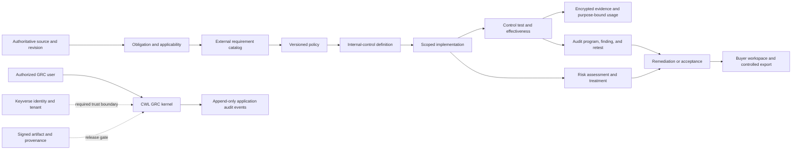

# Product and technical gap baseline

Snapshot: 2026-08-21, Asia/Seoul
Repository: `ContextualWisdomLab/governance-risk-compliance`  
Baseline source head: `78770c63d16a6124dbb1d647c3ac482624f1745a`
Develop-based buyer-workspace head: `30db69b4bf0ef39654cfaba460c7d4ba66ecc91d`
Active reviewed security/model/catalog/obligation fix heads: PR #32 `2e5daf62f82ee7873cb947390f50f161c173729d`, PR #33 `7922d9be1aca16a0ffbd59d44e0183dd2ef7155b`, PR #37 `ddab5c1838d68f471b62f9579acb8fefda017754`, PR #38 `0c4084705b4f86913acdefa1ada3d17aa2d1e6f7`, PR #40 `4daab149d364f6117e31df22e14e11ad35d230b2`, and PR #41 `a3b6b76652097af2a16441f7f7d14f000212deea`. This baseline follow-up is PR #39.

This document is the current product and technical truth baseline. It separates
observed runtime or GitHub evidence from inferred gaps and proposed acceptance
work. A green local test run, a merged pull request, a catalog mapping, or a
readiness manifest is not a production or compliance certification.

The active repository ruleset `18156473` requires two approving reviews,
approval of the last pushed commit, resolved review threads, and the central
required workflows before a protected merge.

## Executive outcome

The repository has a credible first buyer slice: an officer can author an
immutable, versioned policy, map it to seeded official external-requirement
identifiers, attach encrypted evidence, and query a preliminary uncovered list.
The product is not ready for remote customer use because identity, tenant
authorization, key recovery, release provenance, operational telemetry, and
stable production contracts remain incomplete.

The first slice also stops before the central enterprise-GRC distinction between
an external requirement, an organization-designed internal control, one deployed
implementation, a control test, and an effectiveness conclusion. Directly
binding evidence to `control_item` can prove artifact presence but cannot prove
that a control was implemented or operated effectively.

PR #32 stages the Issue #27 product-model correction on top of PR #31. Its
current exact head `2e5daf62f82ee7873cb947390f50f161c173729d` adds the latest
operating-result review fix and the migration DDL SAST fix. Exact-head Product
#602 is successful and SAST/Security #198 are queued; local 155-test 100%
statement/branch/docstring evidence, actionlint, and Semgrep zero-findings
evidence pass. It remains unmerged and has no independent formal approval.

PR #33 stages the Issue #28 obligation-applicability correction on top of PR
#32. Its current exact head `7922d9be1aca16a0ffbd59d44e0183dd2ef7155b` is aligned
to PR #32's current head and includes the migration SQL hardening. The local
suite has 166 passing tests with 100% statement/branch/docstring coverage,
Ruff, compile, lock, actionlint, and Semgrep zero blocking findings. A real
PostgreSQL 18.6 probe verified seven migration receipts, required indexes and
17 triggers, immutable source-revision rejection, and cross-tenant obligation
rejection. Product #608 is terminal success and SAST/Security #201 are queued;
two approving reviews and last-push approval remain absent. It remains
unmerged and depends on PR #32's protected review gate.

PR #34 stages the Issue #30 buyer-workspace design authority directly on
`develop`. Its exact head `30db69b4bf0ef39654cfaba460c7d4ba66ecc91d` records the
current NIST SP 800-53 Release 5.2.0 APA 7 reference, rendered Figma header and
content repair,
and the English/Korean i18n contract against the existing checked-in npm
lockfile/Node pin, Storybook build, and Chromium interaction evidence. The
current head has local Python 53-test 100% statement/branch coverage,
Interrogate 100% docstring coverage, Storybook 10.5.10 build, and three
Chromium interaction tests. Product #568 is successful, Buyer Workspace #10 is
in progress, SAST/Security #182 remain queued, and independent review is
outstanding. It remains Draft; the fixture is not authentication, API, export,
accessibility-certification, or deployment evidence.

PR #36 was closed after its earlier base became empty; its historical merge
record is not current source or protected-merge evidence. PR #41 carries the
intended replacement review-fix delta on the current PR #32 head. Its exact
head `a3b6b76652097af2a16441f7f7d14f000212deea` has local 159-test 100%
statement/branch/docstring evidence, actionlint, and Semgrep zero-findings
evidence. Product #604 is terminal success and SAST/Security #199 are queued;
independent formal approval remains outstanding.

PR #37 stages the Issue #29 catalog-provenance slice directly on `develop`.
Its current exact head `ddab5c1838d68f471b62f9579acb8fefda017754` adds the
governed release-review list and metadata-only release comparison after the
server-owned source-host boundary; the locked runtime includes `psycopg[binary]`,
the local suite has 69 passing tests with 100% statement/branch/docstring
coverage, and a real PostgreSQL 18.6 probe verifies migration
`0002_catalog_provenance`, `GET /catalog/releases`, and the exact-head compare
route. Product is terminal-success; CodeQL, SAST, Security, Strix, and
required review workflows remain pending on this exact head. It deliberately
does not claim remote fetching,
OSCAL/OLIR parsing, requirement-level control diff, or `control_framework`
publication; two approving reviews and last-push approval remain outstanding.

PR #38 is the direct-to-`develop` replacement for closed PR #5. Its exact head
`0c4084705b4f86913acdefa1ada3d17aa2d1e6f7` adds an optional caller-owned,
atomic JTI replay guard while preserving reusable bearer-token semantics when
the guard is absent. It responds to the prior exact-head Strix MEDIUM replay
finding on PR #5. Existing exact-head Product #514, SAST #155, Security #155,
and Strix Security Scan and Devin Review are terminal-success; required
`coverage-evidence` remains queued. It is Ready for the required two approving
reviews, remains unmerged, and has neither those approvals nor last-push approval.

PR #40 stages the Issue #30 workflow security correction on PR #34's buyer
workspace branch. Its exact head `4daab149d364f6117e31df22e14e11ad35d230b2`
contains a normal merge of current PR #34 and replaces `npm exec` with the
checked-in local Playwright binary so the browser install path cannot fetch an
unpinned runner package. Local `npm ci`, Storybook, Chromium install, and three
browser tests pass; Product #570 is terminal-success, while SAST/Security #183
and independent approval remain pending.

The next production action is to integrate one verified Keyverse tenant and
actor through the existing policy/evidence flow and prove that the same boundary
holds for every read, write, export, audit event, background job, and stored
relationship. The next product-model action is issue #27: establish internal
control, implementation, testing, effectiveness, deficiency, and evidence-usage
truth before risk and audit workflows depend on the current catalog model.

The complete domain sequence is defined in
[`docs/product/grc-domain-completion-roadmap.md`](product/grc-domain-completion-roadmap.md).

## Evidence convention

- **Observed** means reproduced from the current checkout or a current GitHub
  API/check result.
- **Inferred** means a gap derived from the mission, ADRs, issue contracts, or
  an ownership boundary; it still needs implementation proof.
- **Proposed** means the smallest acceptance slice intended to turn the gap into
  an observable product capability.

## Automation status

No repository workflow on `develop` currently declares an hourly `schedule`
trigger, and no authenticated contextual-orchestrator scheduler executor is
available in this environment. No placeholder automation was added. The next
automation action is to use an approved central scheduler identity for the
protected PR queue, exact-head checks, independent review, and safe handoff
evidence rather than duplicating a privileged loop in this repository.

## Current product contract

| Capability | Observed implementation | Boundary that still matters |
| --- | --- | --- |
| Policy authoring | `policy_document`, immutable `policy_version`, and `policy_control_mapping`; HTTP and CLI paths exist. | No approval/publication workflow, effective period, scheduled review, or tenant-backed identity. |
| External-requirement catalogs | CSAP 2026.07, SOC 2 TSC, ISMS-P, ISO/IEC 27001:2022, NIST SP 800-53 Rev. 5, COSO 2013, and COSO 2017 identifiers are seeded. | The catalog is a small checked-in slice, not a licensed source-artifact ingestion, edition-diff, OSCAL, or OLIR service. |
| Requirement/control semantics | PR #32 stages separate objectives, versioned internal-control definitions, scoped implementations, reviewed mappings, design/operating tests, deficiencies, exceptions, and evidence usage; direct bindings project to `unassessed`. | PR #32 is stacked and unmerged; stable authenticated APIs, production identity, and downstream risk/audit consumers remain incomplete. |
| Compliance applicability | PR #33 stages tenant-scoped source revisions, obligations, jurisdictions, applicability decisions, commitments, regulatory changes, impact assessments, proposed-only requirement links, null-safe target uniqueness, and overdue/upcoming worklists; current-head local, PostgreSQL, and external-gate evidence is recorded above. | PR #33 is stacked and unmerged; production Keyverse authorization, stable versioned APIs, external source ingestion, independent approval workflow, and downstream risk/audit workflows remain incomplete. |
| Evidence | Evidence is encrypted at rest, exact operational values remain usable, and artifacts bind to catalog rows. | Rotation, KMS/HSM, recovery rehearsal, disposition, request/review workflow, purpose-specific exports, and tenant authorization are incomplete. |
| Gap query | PR #32 projects latest policy mappings and catalog rows through explicit control statuses; legacy direct bindings remain `unassessed`. | The feature is not merged, and risk priority, production ownership, authenticated APIs, and remediation workflows remain absent. |
| Integrity | SQLite/PostgreSQL triggers protect audit history and finalized policy history; stale policy writers receive `409 Conflict`. | PostgreSQL lifecycle work is in PR #18 and is not merged at this snapshot. |
| Runtime boundary | The HTTP server is loopback-only; `X-Actor-Id` and `X-Purpose` are explicitly non-authenticating declarations. | No production remote deployment is permitted until Keyverse identity, tenant authorization, and deployment hardening close the trust boundary. |
| Module boundary | `create_app()` and the `cwl_grc` package support standalone or imported use. | Authenticated versioned service contracts and cross-repository contract tests do not yet exist. |
| Quality | Product workflows require locked dependencies, lint, docstrings, compile, and 100% statement/branch coverage. | Passing quality gates proves code quality only for the tested scope; it does not establish product completeness, effectiveness, or certification. |

Authoritative first-slice decisions are in
[ADR 0001](adr/0001-control-evidence-first-slice.md) and
[ADR 0002](adr/0002-policy-versioning-official-controls.md). The product-model
separation is proposed in
[ADR 0011](adr/0011-separate-external-requirements-and-internal-controls.md).
The implementation remains a modular kernel, not a monolith that absorbs
identity, employment, architecture, data catalog, billing, communications, or
organization-wide security scanning.

## Buyer-visible gap register

`G-*` identifiers are product-analysis identifiers in this document. They are
not GitHub issue numbers, control identifiers, certifications, or release gates.
One implementation issue may address several gaps, and a gap may require several
issues and PRs.

| ID | Priority | Buyer-visible gap | Current evidence | Proposed acceptance slice | Authority |
| --- | --- | --- | --- | --- | --- |
| G-01 | P0 | A customer cannot safely use the product remotely because caller identity and tenant are not verified. | Local-only boundary in `cwl_grc/remote_access.py`; issue #4; closed PR #5 is superseded by direct-to-`develop` PR #38, while PRs #6, #7, and #16 remain staged Keyverse work. | Verify issuer, audience, token type, signature, actor, tenant, workspace, client, principal kind, role, purpose, and action scope on every protected read/write/export/background job. | [Issue #4](https://github.com/ContextualWisdomLab/governance-risk-compliance/issues/4) |
| G-02 | P0 | Operators can encounter ambiguous schema ownership or migration failure in durable PostgreSQL deployments. | PR #18 implements the first schema-lifecycle slice, including explicit ownership, compatibility checks, PostgreSQL acceptance, and review fixes. | Merge only after fresh exact-head Product, PostgreSQL, SAST, Security, semantic review, zero valid unresolved findings, and live branch-policy evidence. | [Issue #8](https://github.com/ContextualWisdomLab/governance-risk-compliance/issues/8) |
| G-03 | P0 | Loss, rotation, retention, legal hold, or recovery failure can make exact operational evidence unavailable or non-compliant. | PR #20 adds versioned key metadata and bounded rewrap; PR #21 adds retention and tenant-scoped legal-hold transitions. Both are stacked and unmerged. | Add production KMS/HSM, durable rewrap receipts, disposition, purpose-specific disclosure, encrypted backup, PITR, restore verification, RPO/RTO, and emergency read-only operation. | [Issue #9](https://github.com/ContextualWisdomLab/governance-risk-compliance/issues/9) |
| G-04 | P0 | A buyer cannot independently verify that a released artifact came from reviewed source or can be rolled back safely. | No signed production OCI/wheel release, artifact-bound SBOM/provenance, protected promotion, or revocation rehearsal is merged. | Build immutable signed artifacts, verify the exact security result, promote by digest, enforce rulesets, and rehearse install/upgrade/rollback/revocation. | [Issue #10](https://github.com/ContextualWisdomLab/governance-risk-compliance/issues/10) |
| G-05 | P0 | Operators lack merged readiness, telemetry, SLO, alerting, and incident evidence. | `develop` still exposes the first-slice constant `/healthz`; PRs #22–#26 and #31 stage readiness, request/database/pool/recovery telemetry and a proposed SLO policy. | Complete collector delivery, recording rules, dashboards, burn-rate paging, recovery coordinator, service-owner approval, rollback/restore rehearsal, and production integration evidence. | [Issue #11](https://github.com/ContextualWisdomLab/governance-risk-compliance/issues/11) |
| G-06 | P1 | Consumers cannot safely depend on a stable production API or bounded resource behavior. | Routes are unversioned, broad dictionaries remain, list APIs are unpaginated, mutations lack a complete idempotency contract, and errors are endpoint-specific. | Add `/v1`, strict models, cursor pagination, idempotency, ETags/preconditions, RFC 9457 errors, bounded media/size/time/concurrency, OpenAPI security, fuzz/property and consumer-contract tests. | [Issue #12](https://github.com/ContextualWisdomLab/governance-risk-compliance/issues/12) |
| G-07 | P1 | The product cannot register, assess, treat, accept, monitor, and close risk through reviewed control-effectiveness truth. | No risk register or methodology exists; issue #13 now explicitly depends on internal-control implementation and test truth from #27. | Add immutable methodology-versioned inherent/residual assessments, appetite/tolerance, treatment, time-bounded acceptance, reviews, indicators, escalation, and non-duplicated mitigation. | [Issue #13](https://github.com/ContextualWisdomLab/governance-risk-compliance/issues/13) |
| G-08 | P1 | An auditor cannot run a complete governed audit from program planning through independent closure. | Evidence and `audit_event` exist, but audit universe, program, engagement, procedures, sampling, workpapers, findings, competence, independence, supervision, remediation, retest, closure, and quality assessment do not. | Implement the ISO 19011:2026 and IIA-aligned workflow against actual internal-control implementations and purpose-bound evidence usage. | [Issue #14](https://github.com/ContextualWisdomLab/governance-risk-compliance/issues/14) |
| G-09 | P0 | A green workflow can be mistaken for release authority without one exact machine-verifiable readiness decision. | PR #17 adds a fail-closed readiness manifest and repository-file evidence binding; it remains unmerged and intentionally reports `production_ready=false`. | Require exact current source/artifact evidence, freshness, branch policy, security gates, independent approval, and zero blockers before release mode succeeds. | [Issue #15](https://github.com/ContextualWisdomLab/governance-risk-compliance/issues/15) |
| G-10 | P1 | Catalog maintenance can drift, lose provenance, overstate mappings, or redistribute source text without authority. | Catalog rows are manually checked into `cwl_grc/catalog.py`; PR #37 now stages provenance metadata, source/version/import/receipt/release persistence, a governed release-review list, metadata-only release comparison, reviewed APA references, a server-owned source-host boundary, and a locked PostgreSQL driver, but no remote fetch, OSCAL/OLIR parser, requirement-level diff, or `control_framework` publication is claimed. | Add lawful source-artifact ingestion, requirement-level versioned release/diff, export restrictions, OSCAL 1.2.3 Catalog/Profile/Mapping round trips, reviewed mapping semantics, OLIR provenance, and change impact. | [Issue #29](https://github.com/ContextualWisdomLab/governance-risk-compliance/issues/29) |
| G-11 | P1 | A buyer lacks a role-aware compliance workspace, evidence request room, external-auditor data room, and controlled export. | PR #34 exact head `30db69b4bf0ef39654cfaba460c7d4ba66ecc91d` adds Figma/Storybook authority, semantic design tokens, exact-value and next-action fixture states, lockfile/Node pinning, Chromium interaction evidence, rendered desktop-header/content and mobile layout repair, and a tested English/Korean i18n contract; PR #40 exact head `4daab149d364f6117e31df22e14e11ad35d230b2` stages the local pinned-Playwright correction. It remains a static local preview. | Deliver tenant- and purpose-scoped posture, traceability, real evidence requests, action queues, accessible exact-value views, reproducible CSV/JSON/PDF exports, i18n consistency, and expiring/revocable auditor packages. | [Issue #30](https://github.com/ContextualWisdomLab/governance-risk-compliance/issues/30) |
| G-12 | P1 | Cross-repository consumers cannot rely on a governed GRC contract. | Architecture names Keyverse, Orgmetra, AIS, Billing, naruon, EA, and Semantic Data Portal as future consumers or authorities only. | Publish minimal OpenAPI/event contracts, opaque references, purpose/tenant/provenance envelopes, contract tests, and explicit authoritative/observed/inferred/proposed boundaries. | [ARCHITECTURE.md](../ARCHITECTURE.md) |
| G-13 | P0 | External requirements, internal controls, implementations, tests, and evidence use are conflated. | PR #32 exact head `2e5daf62f82ee7873cb947390f50f161c173729d` stages the separated model plus the latest-operating-result and migration SAST fixes; PR #41 exact head `a3b6b76652097af2a16441f7f7d14f000212deea` carries the replacement review-fix delta. Neither has independent approval or protected merge evidence. | Obtain terminal exact-head gates and independent approval for PR #32, merge it through branch protection, then revalidate and merge PR #41 before authenticated stable APIs and risk/audit consumers depend on the model. | [Issue #27](https://github.com/ContextualWisdomLab/governance-risk-compliance/issues/27) |
| G-14 | P1 | The product cannot prove which laws, regulations, contracts, and commitments apply to a precise tenant, scope, jurisdiction, and time. | PR #33 exact head `7922d9be1aca16a0ffbd59d44e0183dd2ef7155b` stages source revisions, obligations, jurisdiction references, applicability decisions, legal interpretations, commitments, proposed-only requirement links, source changes, impact assessments, tenant checks, null-safe target uniqueness, immutable guards, and real PostgreSQL 18.6 migration/tenant/immutability evidence; Product #608 is terminal success, SAST/Security #201 are queued, and no protected merge is observed. | Complete the protected PR #32 → PR #33 merge sequence, then add production Keyverse authorization, independent approval workflow, lawful source-artifact ingestion/diff, stable authenticated APIs, and downstream risk/audit/workspace consumers. | [Issue #28](https://github.com/ContextualWisdomLab/governance-risk-compliance/issues/28) |

## Current open-issue snapshot

Snapshot inclusion rule: every GitHub issue returned as open for this repository
on 2026-08-21. Pull requests are excluded and listed separately below. All 13
entries were open at the snapshot; their state can change after this commit.

| Issue | Snapshot state | Primary gap / purpose |
| --- | --- | --- |
| [#4](https://github.com/ContextualWisdomLab/governance-risk-compliance/issues/4) | Open | G-01 — Keyverse identity and tenant authorization |
| [#8](https://github.com/ContextualWisdomLab/governance-risk-compliance/issues/8) | Open | G-02 — PostgreSQL schema lifecycle |
| [#9](https://github.com/ContextualWisdomLab/governance-risk-compliance/issues/9) | Open | G-03 — evidence key, retention, legal hold, and recovery |
| [#10](https://github.com/ContextualWisdomLab/governance-risk-compliance/issues/10) | Open | G-04 — signed release and protected promotion |
| [#11](https://github.com/ContextualWisdomLab/governance-risk-compliance/issues/11) | Open | G-05 — readiness, telemetry, SLO, and incident operations |
| [#12](https://github.com/ContextualWisdomLab/governance-risk-compliance/issues/12) | Open | G-06 — versioned API, concurrency, and abuse controls |
| [#13](https://github.com/ContextualWisdomLab/governance-risk-compliance/issues/13) | Open | G-07 — risk register, treatment, and acceptance |
| [#14](https://github.com/ContextualWisdomLab/governance-risk-compliance/issues/14) | Open | G-08 — audit program, findings, remediation, and closure |
| [#15](https://github.com/ContextualWisdomLab/governance-risk-compliance/issues/15) | Open | G-09 — machine-verifiable readiness evidence gate |
| [#27](https://github.com/ContextualWisdomLab/governance-risk-compliance/issues/27) | Open | G-13 — separate external requirements and internal controls |
| [#28](https://github.com/ContextualWisdomLab/governance-risk-compliance/issues/28) | Open | G-14 — obligation, applicability, and regulatory change |
| [#29](https://github.com/ContextualWisdomLab/governance-risk-compliance/issues/29) | Open | G-10 — catalog governance, OSCAL, and OLIR |
| [#30](https://github.com/ContextualWisdomLab/governance-risk-compliance/issues/30) | Open | G-11 — buyer workspace, evidence room, and exports |

## Current pull-request queue

Snapshot inclusion rule: every open pull request is listed. Rows without a date
marker use the full 40-character head SHA observed on 2026-08-20; PRs #6, #7,
#16, #18, #19, #32, #33, and #41 were rechecked or reconstructed on 2026-08-21
after their current-head or branch-boundary updates. PR #36 is closed with a
historical merge record, but its source is not treated as current evidence;
PR #41 carries the intended replacement delta. PR #39 uses its immutable
parent head because embedding its child head would change this document on
every edit. A later push makes a row stale and requires a new snapshot. No
self-approval, admin merge, force-push, or predecessor-head evidence is valid.

| PR | Exact head at snapshot | State | Current evidence/action |
| --- | --- | --- | --- |
| [#18](https://github.com/ContextualWisdomLab/governance-risk-compliance/pull/18) | `0cd4b1b61f2691d710311b5de195cb9af18fe46d` | Ready, mergeable, review-required | Current head includes the import-style review fix and makes the PostgreSQL workflow execute all three real acceptance modules. Exact-head local evidence is 86 passed and 23 skipped with 100% statement/branch coverage, Ruff, Interrogate, uv lock, actionlint, and 23/23 real PostgreSQL 18.4 acceptance tests passing; Product, both PostgreSQL workflow runs, Devin, and CodeRabbit are terminal-success, while Analyze/SAST/Security/Strix and required workflows remain pending. Two approving reviews and last-push approval remain required. The earlier Strix high finding remains documented as a false positive by exact-source review because `require_purpose` fails closed and every protected mutation consumes the accepted decision. |
| [#17](https://github.com/ContextualWisdomLab/governance-risk-compliance/pull/17) | `d42928e127c09a11d3aecba9ded35f5c6bbcc7a2` | Ready, mergeable, review-required | Product, Production Readiness, SAST, and Security runs were previously observed green on this head, but no independent formal approval was observed. Keep the readiness result intentionally false. |
| [#20](https://github.com/ContextualWisdomLab/governance-risk-compliance/pull/20) | `834868d4a6118bb0eeed3079e0c1407bf61303e0` | GitHub Ready metadata; semantically stacked | Body describes the first #9 key-lifecycle slice as Draft and dependent on #16, but GitHub metadata is non-draft. Restore Draft or otherwise prevent out-of-order merge; retain KMS, recovery, retention, legal-hold, and export gaps. |
| [#21](https://github.com/ContextualWisdomLab/governance-risk-compliance/pull/21) | `9ddabe8cffde7d97d3762403d8988b8d6ca970ef` | GitHub Ready metadata; semantically stacked | Body describes retention/legal hold as Draft and stacked on #20, but GitHub metadata is non-draft. Restore Draft or otherwise prevent out-of-order merge; disposition and recovery remain open. |
| [#22](https://github.com/ContextualWisdomLab/governance-risk-compliance/pull/22) | `47be55018da565fc34d4ab8f9afb6053dd7eba3b` | Ready, stacked, review-required | Operational readiness slice stacked on #21. Product evidence exists for the slice; parent integration, full exact-head security/review requirements, telemetry, and remote-boundary work remain. |
| [#23](https://github.com/ContextualWisdomLab/governance-risk-compliance/pull/23) | `fac1c0017aaeefcc4a6d966cbdfbe05e1b2163d4` | Ready, stacked, review-required | Request telemetry stacked on #22. Collector acceptance, database/pool/recovery metrics, SLO, paging, restore/rollback, parent integration, and independent approval remain. |
| [#24](https://github.com/ContextualWisdomLab/governance-risk-compliance/pull/24) | `84c12650347637dea849d1fe6d6f7d9a020e7799` | Ready, stacked, review-required | Database transaction telemetry stacked on #23. Pool/recovery signals, collector acceptance, SLO, paging, recovery rehearsal, parent integration, and independent approval remain. |
| [#25](https://github.com/ContextualWisdomLab/governance-risk-compliance/pull/25) | `a62d66e5ce3efedf27b11a8cae689db85989587d` | Ready, stacked, review-required | Proposed SLO/error-budget policy stacked on #24. Service-owner approval, collector delivery, recording rules, dashboards, paging, recovery rehearsal, and exact-head acceptance remain. |
| [#26](https://github.com/ContextualWisdomLab/governance-risk-compliance/pull/26) | `7564e175eb1d8bd9797184583cb681a5aa2225a6` | Ready, stacked, review-required | Bounded database-pool telemetry stacked on #25. Product run #442 is terminal-success on the exact head; no other workflow run was returned for that head, and independent approval remains unobserved. |
| [#31](https://github.com/ContextualWisdomLab/governance-risk-compliance/pull/31) | `2e34c86b9a0c20fade2b6b67c1e472fa599228d2` | Ready, stacked, review-required | Declared recovery-event telemetry stacked on #26. Product run #450 is terminal-success on the exact head; the PR expressly excludes a recovery coordinator, collector, dashboards, paging, rehearsal, owner approval, and production recovery evidence. |
| [#32](https://github.com/ContextualWisdomLab/governance-risk-compliance/pull/32) | `2e5daf62f82ee7873cb947390f50f161c173729d` (2026-08-21) | Ready, stacked, review-required | Internal-control model stacked on #31 for Issue #27. The current head fixes latest-result staleness and the migration DDL SAST findings; local 155-test 100% statement/branch/docstring, actionlint, and Semgrep zero-findings evidence pass. Product #602 is successful and SAST/Security #198 are queued; predecessor Product #468 does not transfer and two approving reviews plus last-push approval remain required. |
| [#33](https://github.com/ContextualWisdomLab/governance-risk-compliance/pull/33) | `7922d9be1aca16a0ffbd59d44e0183dd2ef7155b` (2026-08-21) | Ready, stacked, review-required | Obligation applicability and regulatory-change model stacked on current PR #32 for Issue #28. Current head has 166 passing tests with 100% statement/branch/docstring coverage, Ruff, compile, lock, actionlint, Semgrep zero blocking findings, and a real PostgreSQL 18.6 migration/index/trigger/tenant/immutability probe. Product #608 is terminal success and SAST/Security #201 are queued; two approving reviews plus last-push approval remain outstanding. |
| [#34](https://github.com/ContextualWisdomLab/governance-risk-compliance/pull/34) | `30db69b4bf0ef39654cfaba460c7d4ba66ecc91d` | Draft, mergeable, review-required | Issue #30 buyer-workspace design authority on `develop`. The exact current head has local Python 53-test 100% statement/branch coverage, Interrogate 100% docstring coverage, Storybook 10.5.10 build, three Chromium interaction tests including English/Korean switching and stable state identifiers, current NIST SP 800-53 Release 5.2.0 APA 7 reference, and rendered Figma repair evidence: desktop header/content fill with 2:1 panels plus mobile wrapped/stacked content without horizontal clipping. Product #568 is successful, Buyer Workspace #10 is in progress, SAST/Security #182 are queued, and independent review remains outstanding. |
| [#35](https://github.com/ContextualWisdomLab/governance-risk-compliance/pull/35) | `2861c9c5bfd17f6ac6778e42db1b4d735a809ce9` | Draft, stacked, review-required | Buyer-gap baseline refresh for PR #33 and PR #34 on the baseline branch. PR #39 carries the current queue follow-up; neither docs PR is production, issue-completion, or merge approval evidence. |
| [#37](https://github.com/ContextualWisdomLab/governance-risk-compliance/pull/37) | `ddab5c1838d68f471b62f9579acb8fefda017754` (2026-08-21) | Draft, mergeable, review-required | Issue #29 catalog-provenance slice on `develop`. Current head adds governed release listing and metadata-only comparison; the locked runtime includes `psycopg[binary]`, local 69-test 100% statement/branch/docstring, Ruff, compile, lock, actionlint, diff, and Semgrep zero-blocking evidence pass, plus a real PostgreSQL 18.6 migration and exact-head endpoint/comparison probe. Product is terminal-success; CodeQL, SAST, Security, Strix, and required review workflows remain pending; scope excludes remote source retrieval, OSCAL/OLIR parsing, requirement-level control diff, and two approving reviews plus last-push approval remain outstanding. |
| [#38](https://github.com/ContextualWisdomLab/governance-risk-compliance/pull/38) | `0c4084705b4f86913acdefa1ada3d17aa2d1e6f7` | Ready, direct to `develop`, review-required | Replacement for closed PR #5. The exact head adds an optional caller-owned atomic JTI replay guard; local 72-test 100% evidence and exact-head Product/SAST/Security/Strix/Devin success are observed, while required `coverage-evidence` remains queued and two approving reviews plus last-push approval remain outstanding. |
| [#39](https://github.com/ContextualWisdomLab/governance-risk-compliance/pull/39) | parent `2861c9c5bfd17f6ac6778e42db1b4d735a809ce9` | Draft, stacked, review-required | Current buyer-gap baseline follow-up stacked on PR #35. Its child head is intentionally tracked by the PR metadata because this document records the queue it describes; it records the exact heads and observed boundaries for PR #32, #33, #37, #38, #40, and #41 and remains documentation evidence only. |
| [#40](https://github.com/ContextualWisdomLab/governance-risk-compliance/pull/40) | `4daab149d364f6117e31df22e14e11ad35d230b2` | Draft, stacked, review-required | Scorecard Pinned-Dependencies fix for PR #34. A normal merge commit brings the current PR34 base into the child; the stacked diff remains one workflow-line change. Local Python 53-test/100% coverage, Interrogate 100%, Storybook, actionlint, and three browser tests pass; Product #570 is successful, SAST/Security #183 are queued, and independent approval remains outstanding. |
| [#41](https://github.com/ContextualWisdomLab/governance-risk-compliance/pull/41) | `a3b6b76652097af2a16441f7f7d14f000212deea` (2026-08-21) | Draft, stacked, review-required | Replacement for closed PR #36 on the current PR #32 head. The two exact-head Semgrep findings in migration SQL are replaced with SQLAlchemy `DDL`/`Index` constructs; the branch also carries the owner-graph, race, and coverage review fixes. Local 159-test 100% statement/branch/docstring, full lint/compile/lock/actionlint/diff checks, and Semgrep zero-findings evidence pass. Product #604 is terminal success, SAST/Security #199 are queued, and independent approval remains outstanding. |
| [#19](https://github.com/ContextualWisdomLab/governance-risk-compliance/pull/19) | `de571802239ba819b0fd5201993f2e20ddad5645` (2026-08-21) | Ready, review-required | Documentation baseline and GRC roadmap review fixes. The current head makes `not_applicable` require an exact authorized decision, maps applicable-without-implementation/evidence to `unknown`, records `posture-projection-v1` and input fact versions, and enumerates the complete release-gate token set. Prior checks do not transfer; Product #576 and SAST/Security #186 are queued, and independent approval remains outstanding. |
| [#16](https://github.com/ContextualWisdomLab/governance-risk-compliance/pull/16) | `c1496be499473befc273ff55ea284ac9f5582b73` (2026-08-21) | Draft, mergeable | Tenant isolation remains stacked behind #7; Product #398 is terminal-success, and local 118-test coverage is 100% across 1,307 statements and 330 branches with Interrogate/Ruff/compile/lock/diff checks passing. Preserve the shared official catalog outside tenant-owned records and regenerate all current-head gates after parent integration. |
| [#7](https://github.com/ContextualWisdomLab/governance-risk-compliance/pull/7) | `ebac50ccbb9cf528044cc53d4832ceec176b50c9` (2026-08-21) | Draft, mergeable | Route enforcement remains stacked behind #6; Product #396 is terminal-success, and local 109-test coverage is 100% across 1,267 statements and 318 branches with Interrogate/Ruff/compile/lock/diff checks passing. Revalidate every protected route and scope on the integrated parent. |
| [#6](https://github.com/ContextualWisdomLab/governance-risk-compliance/pull/6) | `887f5c64843cca5cd8f699cae58e33afa3b7498f` (2026-08-21) | Draft, mergeable | OIDC/JWKS loading remains stacked behind #5; Product #394 is terminal-success and local exact-head pytest, 100% statement/branch coverage, Interrogate, Ruff, compile, lock, actionlint, and diff checks pass. Preserve bounded source retrieval, exact issuer matching, address pinning, TLS identity, and rotation semantics. |
| [#5](https://github.com/ContextualWisdomLab/governance-risk-compliance/pull/5) | `0c9c2525918f0f392185942065920c376ef9de28` | Closed, superseded | Closed without merge after its exact-head Strix replay-protection finding. PR #38 is the direct-to-`develop` replacement and carries the optional caller-owned atomic JTI replay guard; predecessor checks do not transfer. |

PR #19 carries this snapshot on branch `docs/product-technical-gap-baseline`.
It is not its own production, issue-completion, or merge approval.

The current branch endpoint reports `develop` as `protected: true`, but its
returned protection object has `enabled: false`, required-status-check
enforcement `off`, and empty required contexts/checks. This is an observed
repository-governance gap, not permission to bypass checks or independent
review. Confirm and enforce the organization ruleset through the authorized
control plane before merging or releasing.

## Technical architecture and ownership gaps

GRC owns obligation/applicability decisions, policies, external-requirement
references, internal controls, implementations, tests, evidence usage, risk,
GRC audit, remediation, and GRC reporting truth. Keyverse owns identity and
authorization. Central security workflows own scanners. Other products retain
people, architecture, data, billing, and communication truth and expose
versioned references. Inferred relationships from AI or lineage products remain
`inferred` or `proposed` until an authorized GRC review changes their status.

Database acceptance remains 3NF by default. New database objects use at least
two-word `snake_case`, tenant consistency at the database boundary, immutable or
superseded history, and distinct business-valid/system-recorded time where
reconstruction matters. Before high-volume `audit_event`, evidence-usage,
telemetry, workflow, or export tables are introduced, define and test indexing,
partitioning, retention, and hot-partition behavior. No current evidence proves
the future enterprise workload is partitioned or load-tested.

## Standards and doctoring actions

The doctoring baseline now includes:

- ISO 37301:2021, confirmed current in 2026, and Amendment 1:2024 for compliance
  management and obligation framing;
- ISO 19011:2026 Edition 4, replacing withdrawn ISO 19011:2018 for
  management-system audit guidance;
- NIST OSCAL 1.2.3 model documentation, including Catalog, Profile, Control
  Mapping, Component Definition, SSP, Assessment Plan, Assessment Results, and
  POA&M models; and
- the NIST OLIR Program for versioned informative-reference mappings.

NIST issued final SP 800-53 Release 5.2.0 on August 27, 2025. It adds and
revises controls, enhancements, discussions, related controls, references, and
corresponding assessment procedures. The checked-in `nist_sp_800_53_r5` rows are
a manually authored first-slice subset based on the 2020 Rev. 5 catalog; they
have not been refreshed, diffed, or proven complete against Release 5.2.0.
Issue #29 must ingest an exact lawful artifact, preserve its digest and import
receipt, compute the reviewed change set, and decide whether to retain the
framework key or introduce a release-specific identity before the product
claims a 5.2.0 catalog baseline.

Catalog ingestion must consume authoritative source artifacts and preserve exact
release, digest, parser receipt, publisher, mapping status, and license/export
policy. Search results, generated summaries, or LLM proposals cannot become
source truth. ISO and other licensed publications must not be copied, transformed,
or exported without recorded authority. Supporting an identifier, crosswalk, or
OSCAL adapter does not establish conformance or certification.

PR #34 now records a bounded Figma/Storybook design authority, semantic tokens,
accessibility and exact-value-table behavior, keyboard/touch action edges,
print/PDF, responsive states, a tested English/Korean i18n contract, ownership
boundaries, and a rendered repair of the desktop/mobile authority frames.
Those artifacts are still static design evidence; a customer-facing component
system requires authenticated contracts, connected data, export controls, and
release evidence.

## Verification loop

1. Re-fetch each PR’s exact head, base, checks, reviews, and unresolved threads.
2. Fix valid findings at the shared root and add a realistic regression test for
   every non-trivial security, parser, concurrency, data-integrity, temporal,
   authorization, or workflow rule.
3. Run `git diff --check` against the entire exact-head PR diff, then run locked
   Product, docstring, compile, PostgreSQL, contract, SAST, Security,
   semantic-review, accessibility, and applicable end-to-end gates on that same
   unchanged head.
4. Confirm independent approval and the live organization ruleset; merge only
   through the protected path and expected head.
5. After each merge, advance the next stacked PR only if its ownership boundary
   remains correct; regenerate all exact-head evidence rather than transferring
   predecessor results.
6. Update this baseline, the domain roadmap, ADRs, doctoring, README, CHANGELOG,
   readiness manifest, and issue dependencies whenever current truth changes.
7. When the active queue is empty, select the highest buyer-visible gap whose
   prerequisites are satisfied and ship one complete vertical slice rather than
   producing a disconnected scaffold.

## Product status

The repository remains a loopback-only developer preview until G-01 through
G-05 have current production evidence and G-09 succeeds under independent
release authority. It must not be described as a remote-ready service.

Even after remote exposure becomes safe, the repository is not a completed
enterprise GRC product until G-13 establishes internal-control and effectiveness
truth and the dependent obligation, risk, audit, interoperability, remediation,
and buyer-workspace loops are implemented and evidenced. No document, score,
mapping, green CI run, or export in this repository should be presented as a
compliance certification.
