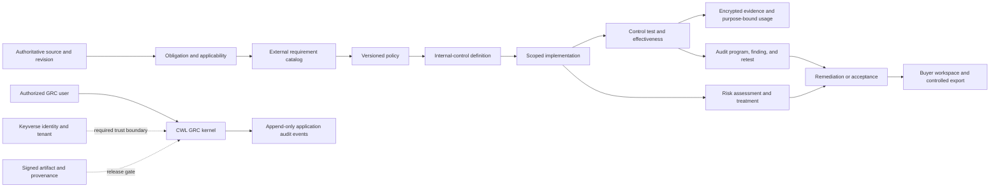

# Product and technical gap baseline

Snapshot (document generation date): 2026-08-24, Asia/Seoul
Repository: `ContextualWisdomLab/governance-risk-compliance`  
Baseline parent branch head: `a747077757484c880fccf76e30cac068c593d3b0` (protected `develop`)
Baseline source parent: `c78ef79499d05e13a8651ccfa2a2979724323160` (pre-refresh PR #19 source parent; re-query the current document branch head below)
Develop-based officer-workspace head: `ed1e6222df0ff021fb72d40d79a242bae71754c4`
Tracked current open direct-to-develop heads: PR #17 `7b4adbe0964e12e4b31e197ab10a63aabf0f593c`, PR #18 `35d3e55ccd2c5e89efec6c28b7613f1d605cac13`, PR #34 `ed1e6222df0ff021fb72d40d79a242bae71754c4`, PR #37 `9fffa505512d4cf7eccbb6cd240dab6a1e8acb73`, PR #38 `c1445d7105ee7366794a0acb0d0507777850ce9e`, PR #43 `f41c387c62998de2d136ce8f4a110b4cb22906ac`, PR #51 `1a8f90dd15f37ffc86b8a0efd217a8b2812e5f99`, and PR #53 `976945dbbe22b0b8fa7893150e2723738a0ff484`. PR #19 is the current document branch; stacked PR #54 is `3e972f4de9e9a1f5a17379ac93b33bdcb2b0f4cf` on current PR #34 head `ed1e6222df0ff021fb72d40d79a242bae71754c4`; stacked PR #55 is `ab5113c66543392c3a8755fba3e866eb097c4111` on PR #38 `c1445d7105ee7366794a0acb0d0507777850ce9e`; stacked PR #56 is `7794192bd21bc08b4c46e527addfc8cc1a01558e` on PR #55; stacked PR #57 is `1340f4756459f60e1aa43990d827afacf6d4bceb` on PR #56; PR #41 is feature-base PR head `2346afe6a063f502517ee235d6c3e87488da8357` on base `8881d3966e3e9da29b8dce990a95295a2780618b`; re-query all exact heads before merge.
Historical Keyverse stack-only merges: PR #6 `b9b3d5c49367d0b128c87aa478d8921eb1f6c349` merged as `bb23d654f58ea1afdb4087fafdf47caf1de1aaea`, PR #7 `25350d6177244d9a39ae3275feca813d5b4a737d` merged as `b44f3e9f83b637a9a580468be5b5b5f95422127b`, and PR #16 `8dfa6bae1a9366335f15294f06abf8313f1380e4` merged as `34a1b25c38c78f367bc77b90301ef0f68a1ad8ba`. These PRs are closed; their feature-branch merges did not update protected `develop`.
Historical evidence-lifecycle stack-only merges: PR #20 `e91b2384177451ebf80858e518d729e258c40f00` merged as `781b6e3b9f4c33c7d82e46d2881777ea470ff875`, PR #21 `04facc110a7437f7a86b8572707ffb5f65e0515e` merged as `b25cd7dbb9cb1e823f184acc67cea0aa8cea7280`, PR #22 `9c1923e8e6f6145d0f789a97db4dd15f94f2adf3` merged into its feature branch as `04facc110a7437f7a86b8572707ffb5f65e0515e`, and PR #50 `ba78e4790f3e361826991455ce83634004f2875d` merged as `8d355811a2a6b809cfa7e4c03e36a1c6f48bdf49`. PRs #23–#26 and #31 remain historical feature-branch merges; none is an active child PR in the current open-PR snapshot.

This document is the current product and technical truth baseline. It separates
observed runtime or GitHub evidence from inferred gaps and proposed acceptance
work. A green local test run, a merged pull request, a catalog mapping, or a
readiness manifest is not a production or compliance certification.

The active repository ruleset `18156473` requires two approving reviews,
approval of the last pushed commit, resolved review threads, and the central
required workflows before a protected merge.

At this snapshot the live repository collaborator inventory contains only
`seonghobae`; no independent human reviewer request is pending. This is an
observed reviewer-capacity gap, not permission to self-approve or bypass the
ruleset.

## Executive outcome

The repository has a credible first buyer slice: an officer can author an
immutable, versioned policy, map it to seeded official external-requirement
identifiers, attach encrypted evidence, and query a preliminary uncovered list.
The product is not ready for remote customer use because identity, tenant
authorization, key recovery, release provenance, operational telemetry, and
stable production contracts remain incomplete.

The first slice also stops before the central enterprise-GRC distinction between
an external requirement, an organization-designed internal control, one deployed
implementation, a control test, and an effectiveness conclusion. Directly
binding evidence to `control_item` can prove artifact presence but cannot prove
that a control was implemented or operated effectively.

PR #32 stages the Issue #27 product-model correction on top of PR #31. Its
current exact head `c750cb8bdc347f4fc592e2e908f098520e16074f` carries the latest
operating-result, owner-graph, migration-SAST, approved-exception, deterministic
ordering, bounded legacy-identifier, idempotent-backfill, inactive/incomplete
test projection, and time-frozen test fixes. The integrated local suite has 160 tests with 2,405 statements/576 branches and 100% statement/branch/docstring
coverage, Ruff, compile, lock, actionlint, and Semgrep zero findings. No
current-head PostgreSQL probe or predecessor hosted result is claimed;
terminal hosted checks, independent approval, and protected merge remain open.

PR #33 stages the Issue #28 obligation-applicability correction on top of PR
#32. Its current exact head `55afaee88fd0e9113a9fb655da1d2d95275c0e8c` is aligned
to PR #32's current head and includes migration SQL hardening, superseded
decision exclusion, and license-classification artifact enforcement. The
integrated local suite has 171 tests with 2,978 statements/666 branches and
100% statement/branch/docstring coverage, Ruff, compile, lock, actionlint, and
Semgrep zero findings. The predecessor PostgreSQL probe and hosted results do
not transfer after this parent/head rebuild; terminal hosted checks, two
approving reviews, last-push approval, and protected merge remain absent.

PR #34 stages the Issue #30 officer-workspace design authority directly on
`develop`. Its exact head `ed1e6222df0ff021fb72d40d79a242bae71754c4` records
Storybook CSF `play` functions for Accessibility, Touch & Interaction,
Performance, Style Selection, Layout & Responsive, Typography & Color,
Animation, Forms & Feedback, Navigation, and Charts & Data, officer/organization
language instead of customer-facing “Buyer” copy, Figma file
`ta1jjWSjmADz2BFxka9UPs`, design tokens, the Open deficiencies exact-value row,
and the English/Korean i18n contract. Local evidence is 53 Python tests with
100% statement/branch/docstring coverage, Storybook 10.5.10 build, and four
Chromium interaction tests including the officer-workspace Korean story. No
independent approval is present. It is non-Draft; the fixture is not authentication, API,
export, accessibility-certification, or deployment evidence.

PR #36 was closed after its earlier base became empty; its historical merge
record is not current source or protected-merge evidence. PR #41 carries the
intended replacement review-fix delta on the current internal-control feature
base. Its exact head `2346afe6a063f502517ee235d6c3e87488da8357` is normally
restacked on base `8881d3966e3e9da29b8dce990a95295a2780618b`, with verified
merge-result tree `845d082e0f7bf8ef81d819287c8c7e8c4d01b094` and local 165-test
100% statement/branch/docstring evidence, actionlint, and Semgrep zero-findings
evidence. The new-head Product jobs are terminal success; required review
remains pending. Independent formal approval remains outstanding.

PR #42 stages the organization OpenTelemetry acceptance-evidence boundary on
the current PR #32 head. Its exact head
`b482f996deab5f69d3eed15e1d13d68c8de321c0` renumbers the decision record to
the sequential ADR 0012 after a current-head review finding and carries the
latest parent stack. The integrated 160-test head passes 2,405 statements/576
branches with 100% statement/branch/docstring coverage, Ruff, lock, compile,
actionlint, diff, and Semgrep zero-findings checks. It was subsequently merged
as `a86fb10cfcadd18769e5830d0982abea4e728bb5` into
`feat/internal-control-model`, not into protected `develop`; no independent
formal approval or protected-branch merge is inferred.

PR #43 stages the repository-owned caller for the central hourly review-repair
workflow. Its exact head `f41c387c62998de2d136ce8f4a110b4cb22906ac` schedules
one dispatch per hour against `develop`, pins the central reusable workflow to
`55a8b576725451dfe0a21a57d36a2f1a41619b24`, grants only `contents: read` and
`id-token: write`, and passes no model or mutation secret. Local evidence is
48 passing tests with 100% statement/branch coverage, 100% docstring coverage,
Ruff, compile, lock, actionlint, and Semgrep zero blocking findings. The
organization allowlist now includes this public repository with `all`
visibility; that external setting is observed configuration, not merge or
approval evidence. PR #43 is Ready with terminal hosted checks observed and no
independent approval.

The Keyverse buyer-boundary work is represented by direct-to-`develop` PR #38,
the replacement for closed PR #5. Its current exact head is
`c1445d7105ee7366794a0acb0d0507777850ce9e`; it adds the bounded OIDC/JWKS
loader, verified-principal route enforcement, tenant record isolation, and
the undefined-offset provider-clock rejection described below. PRs #6, #7,
and #16 are closed stack-only history with merge commits
`bb23d654f58ea1afdb4087fafdf47caf1de1aaea`,
`b44f3e9f83b637a9a580468be5b5b5f95422127b`, and
`34a1b25c38c78f367bc77b90301ef0f68a1ad8ba`; those commits do not establish
protected `develop` integration, and no active child PR from that stack is in
the current open-PR snapshot. No parent check or approval evidence transfers.

PR #37 stages the Issue #29 catalog-provenance slice directly on `develop`.
Its current exact head `9fffa505512d4cf7eccbb6cd240dab6a1e8acb73` adds the
governed bounded published-release review list, metadata-only release detail
snapshot with explicit license/export policy flags and content-policy mapping,
and published-only metadata comparison after the server-owned source-host
boundary; the locked runtime includes `psycopg[binary]`, the local suite has
81 passing tests with 100% statement/branch/docstring coverage, Ruff, compile,
lock, actionlint, diff, Semgrep zero-blocking evidence, and purpose-scoped
read regressions. The current repair also skips policy migration DDL on partial
stores, enforces matching source version/import-run release links at the
SQLite/PostgreSQL boundary, fails closed on mismatched release snapshots, and
requires declared catalog or policy purpose on sensitive GET surfaces. A real
PostgreSQL 18.4 probe verifies clean migration and protected reads. The hosted
observation is 19 successful, 1 in-progress, 1 queued, and 7 skipped checks;
the new Product run is successful while security/review lanes remain queued.
The predecessor
`strix` failure was a real missing-authorization source finding and is fixed on
this head; no independent approval exists.
It deliberately does not claim remote fetching, OSCAL/OLIR parsing,
requirement-level control diff, or `control_framework` publication; two
approving reviews and last-push approval remain outstanding.

PR #38 is the direct-to-`develop` replacement for closed PR #5. Its exact head
`c1445d7105ee7366794a0acb0d0507777850ce9e` adds an optional caller-owned,
atomic JTI replay guard, enforces scope authorization before replay-token
consumption, and rejects provider refresh clocks whose timezone has no defined
UTC offset. The exact head has 98 local tests with 100% statement/branch/
docstring coverage, full lint/compile/lock/actionlint/Semgrep/pip-audit
evidence after replacing four uncovered protocol ellipsis bodies with
coverage-excluded `pass` stubs. The latest hosted observation is 4 success,
11 queued, and 7 skipped checks; independent approval and last-push approval
remain absent.

PR #51 adds the GRC OpenTelemetry request boundary on `develop`. Its current
fork head is `1a8f90dd15f37ffc86b8a0efd217a8b2812e5f99`, including the sampled-off
traceparent repair, correlation headers, sanitized 500 responses, and explicit
ERROR status for handler-returned 5xx spans. The latest exact head also
disables SDK automatic exception events/status so raw exception text is not
recorded in spans. The exact current tree passes 55 tests with 100%
statement/branch/docstring coverage, Ruff, compile, lock, package build/install
smoke, actionlint, Semgrep (187 rules, zero findings), and diff checks; the
exact-head `osv-scan` succeeded after re-run against current central main
(ContextualWisdomLab/.github#1209). Follow-up ContextualWisdomLab/.github#1257
preserves `old-results.json` in `RUNNER_TEMP` so a zero-finding fork scan cannot
fail on an empty base file. Independent approval remains outstanding.

PR #53 stages the first buyer-visible G-06 API-contract slice directly on
`develop`. Its exact head is `976945dbbe22b0b8fa7893150e2723738a0ff484` on
base `a747077757484c880fccf76e30cac068c593d3b0`. It adds strict Pydantic
version-one policy authoring/list/get/revision and policy-gap routes, bounded
keyset cursors, durable purpose-scoped idempotency records, target-scoped
revision keys with concurrent reservation handling, strong ETags with
`If-Match`, batched paged policy reads, bounded non-reflective RFC 9457
problem details, and OpenAPI deprecation markers for the legacy routes. The
exact-head local suite passes 100% statement/branch and docstring coverage,
Ruff, compile, lock, actionlint, wheel/install smoke, Semgrep zero findings,
pip-audit with no known vulnerabilities, and real PostgreSQL clean-install
and legacy-upgrade rehearsals. The latest hosted observation is 22 successful
and 8 skipped checks, with no independent approval. Gitleaks and osv-scanner binaries are
unavailable in the local environment, so hosted security lanes remain
authoritative. The runtime remains loopback-only and does not claim Keyverse
authentication or tenant authorization. PR #53 is open, non-Draft, not
independently approved, and must follow the normal protected merge path; no
predecessor evidence transfers.

PR #40 stages the Issue #30 workflow security correction on PR #34's buyer
workspace branch. Its exact head `4daab149d364f6117e31df22e14e11ad35d230b2`
contains a normal merge of current PR #34 and replaces `npm exec` with the
checked-in local Playwright binary so the browser install path cannot fetch an
unpinned runner package. Local `npm ci`, Storybook, Chromium install, and three
browser tests pass; Product #570, Scorecard, Semgrep, Trivy, OSV, dependency
review, and required workflow checks are terminal-success, while the current
OpenCode review is queued and independent approval is absent.

PR #45 stages the first real Issue #30 evidence-request workflow on PR #44's
current exact head. Its child head `96b1d11de1838d075189e29d2675e48f75d749a1`
adds tenant-scoped request metadata, same-tenant existing-artifact submission,
different-actor acceptance or rejection, audit history, and workspace state
projection without copying evidence payloads. Local 177-test
statement/branch/docstring, lint, build, migration, security, and real
PostgreSQL temporary-schema evidence pass; both hosted Product runs are
terminal-success, Devin is pending, CodeRabbit is skipped on the non-default
base, and independent approval is absent.

PRs #44–#49 were later reported merged into their respective stack feature
branches: #44 as `ffca199364d24b197b04bbe2f6505851e6b915b3`, #45 as
`21e6d13fcaa0f4baac29049963787d5975ba881a`, #46 as
`216b1c9dd8d476dfe8672c7f6f76aad206276e16`, #47 as
`53f0918c2f093594772f485bb68be6afab429438`, #48 as
`2b2c5c414c9e1558a9f8d25b9b71a761ac767d7a`, and #49 as
`8038d0689cc33a23356166504855d9a692350bdb`. These are stack-only merge
events; the repository's protected `develop` tip did not change, and the live
PR records did not contain independent approving reviews for these events.

PR #55 exact head `ab5113c66543392c3a8755fba3e866eb097c4111` (stacked on
PR #38) enforces Keyverse Bearer tokens on officer HTTP routes, stamps
tenant identifiers, publishes OpenAPI `KeyverseBearer`, keeps local-preview
forms usable without a token, and scopes policy-gap coverage to the verified
tenant's evidence bindings so one organization's CSAP mapping cannot hide
another organization's uncovered control. Local evidence is 111 tests with
100% statement/branch/docstring coverage. Independent approval is absent.

PR #56 exact head `7794192bd21bc08b4c46e527addfc8cc1a01558e` restacks audit
attribution on that parent by merge (no force-push): authorized mutations
persist issuer, OAuth client, request correlation, and `allow` without
copying the access token. Local evidence is 119 tests with 100% coverage.
Independent approval is absent.

PR #57 exact head `1340f4756459f60e1aa43990d827afacf6d4bceb` restacks the
hardened loopback start on PR #56. `CWL_GRC_REQUIRE_KEYVERSE` refuses
header-identity boots, requires readable loopback TLS files, fails closed on
invalid flag values and missing certificate or key files, disables Uvicorn
proxy-header scheme rewriting, loads a reviewed offline JWKS on CLI start, and
names `CWL_GRC_EVIDENCE_KEY` in both hardened-start and ordinary-preview next
actions. Local evidence is 128 tests with 100% coverage. This is not remote
production exposure. Independent approval is absent.

The next production action is independent non-author review of the merge-ready
direct-to-`develop` PRs and of the Keyverse stack (#38 → #55 → #56 → #57).
Do not enable non-loopback customer admission until that review exists. The
next product-model action is issue #27: establish internal control,
implementation, testing, effectiveness, deficiency, and evidence-usage truth
before risk and audit workflows depend on the current catalog model.

The complete domain sequence is defined in
[`docs/product/grc-domain-completion-roadmap.md`](product/grc-domain-completion-roadmap.md).

## Evidence convention

- **Observed** means reproduced from the current checkout or a current GitHub
  API/check result.
- **Inferred** means a gap derived from the mission, ADRs, issue contracts, or
  an ownership boundary; it still needs implementation proof.
- **Proposed** means the smallest acceptance slice intended to turn the gap into
  an observable product capability.

## Automation status

PR #43 now declares the repository-owned hourly caller on `develop`; the
privileged review/repair implementation remains centrally owned by
`.github`'s reusable workflow pinned to exact main commit
`55a8b576725451dfe0a21a57d36a2f1a41619b24`. The caller dispatches at minute 53,
allows one target dispatch, retries transient work for two hours, and has no
write permission or optional mutation secret. The organization variable
`OPENCODE_REPOSITORY_DISPATCH_TARGETS` has been observed to include
`ContextualWisdomLab/governance-risk-compliance` with `all` visibility. Hosted
execution, independent review, exact-head required checks, and protected merge
remain separate gates; no local schedule is evidence that those gates passed.
The live stack merge events above are recorded as a control-plane governance
observation, not as approval or protected-merge evidence; feature branches are
not covered by the default-branch ruleset.

## Current product contract

| Capability | Observed implementation | Boundary that still matters |
| --- | --- | --- |
| Policy authoring | `policy_document`, immutable `policy_version`, and `policy_control_mapping`; HTTP and CLI paths exist. | No approval/publication workflow, effective period, scheduled review, or tenant-backed identity. |
| External-requirement catalogs | CSAP 2026.07, SOC 2 TSC, ISMS-P, ISO/IEC 27001:2022, NIST SP 800-53 Rev. 5, COSO 2013, and COSO 2017 identifiers are seeded. | The catalog is a small checked-in slice, not a licensed source-artifact ingestion, edition-diff, OSCAL, or OLIR service. |
| Requirement/control semantics | PR #32 stages separate objectives, versioned internal-control definitions, scoped implementations, reviewed mappings, design/operating tests, deficiencies, exceptions, and evidence usage; direct bindings project to `unassessed`. | PR #32 is stacked and unmerged; stable authenticated APIs, production identity, and downstream risk/audit consumers remain incomplete. |
| Compliance applicability | PR #33 stages tenant-scoped source revisions, obligations, jurisdictions, applicability decisions, commitments, regulatory changes, impact assessments, proposed-only requirement links, null-safe target uniqueness, and overdue/upcoming worklists; current-head local, PostgreSQL, and external-gate evidence is recorded above. | PR #33 is stacked and unmerged; production Keyverse authorization, stable versioned APIs, external source ingestion, independent approval workflow, and downstream risk/audit workflows remain incomplete. |
| Evidence | Evidence is encrypted at rest, exact operational values remain usable, and artifacts bind to catalog rows. | Rotation, KMS/HSM, recovery rehearsal, disposition, request/review workflow, purpose-specific exports, and tenant authorization are incomplete. |
| Gap query | PR #32 projects latest policy mappings and catalog rows through explicit control statuses; legacy direct bindings remain `unassessed`. | The feature is not merged, and risk priority, production ownership, authenticated APIs, and remediation workflows remain absent. |
| Preview posture | PR #54 stages `GET /workspace/posture` on the PR #34 officer-workspace head, requiring declared actor, `coverage_review` purpose, and tenant, and scoping policy gaps and legacy evidence to that officer. | The projection is a local declaration, not Keyverse authentication, and deliberately reports zero effective controls until Keyverse authorization, internal controls, and effectiveness tests exist. |
| Integrity | SQLite/PostgreSQL triggers protect audit history and finalized policy history; stale policy writers receive `409 Conflict`. | PostgreSQL lifecycle work is in PR #18 and is not merged at this snapshot. |
| Runtime boundary | The HTTP server is loopback-only; `X-Actor-Id` and `X-Purpose` are explicitly non-authenticating declarations. | No production remote deployment is permitted until Keyverse identity, tenant authorization, and deployment hardening close the trust boundary. |
| Module boundary | `create_app()` and the `cwl_grc` package support standalone or imported use. | Authenticated versioned service contracts and cross-repository contract tests do not yet exist. |
| Quality | Product workflows require locked dependencies, lint, docstrings, compile, and 100% statement/branch coverage. | Passing quality gates proves code quality only for the tested scope; it does not establish product completeness, effectiveness, or certification. |

Authoritative first-slice decisions are in
[ADR 0001](adr/0001-control-evidence-first-slice.md) and
[ADR 0002](adr/0002-policy-versioning-official-controls.md). The product-model
separation is proposed in
[ADR 0011](adr/0011-separate-external-requirements-and-internal-controls.md).
The implementation remains a modular kernel, not a monolith that absorbs
identity, employment, architecture, data catalog, billing, communications, or
organization-wide security scanning.

## Officer-visible gap register

`G-*` identifiers are product-analysis identifiers in this document. They are
not GitHub issue numbers, control identifiers, certifications, or release gates.
One implementation issue may address several gaps, and a gap may require several
issues and PRs.

| ID | Priority | Officer-visible gap | Current evidence | Proposed acceptance slice | Authority |
| --- | --- | --- | --- | --- | --- |
| G-01 | P0 | An officer cannot safely use the product remotely because caller identity and tenant are not verified. | Local-only boundary in `cwl_grc/remote_access.py`; issue #4; PR #38 `c1445d7105ee7366794a0acb0d0507777850ce9e` verifies RFC 9068 access tokens and loads OIDC/JWKS; stacked PR #55 `ab5113c66543392c3a8755fba3e866eb097c4111` enforces Bearer tokens, tenant-owned rows, and tenant-scoped gap coverage; PR #56 `7794192bd21bc08b4c46e527addfc8cc1a01558e` attributes audit events without copying tokens; PR #57 `1340f4756459f60e1aa43990d827afacf6d4bceb` requires a Keyverse verifier, readable loopback TLS files, and fail-closed missing cert/key paths. Remote traffic remains denied. | Independent review of the Keyverse stack, then non-loopback customer admission only after that review. Do not treat loopback TLS as production exposure. | [Issue #4](https://github.com/ContextualWisdomLab/governance-risk-compliance/issues/4) |
| G-02 | P0 | Operators can encounter ambiguous schema ownership or migration failure in durable PostgreSQL deployments. | PR #18 implements the first schema-lifecycle slice, including explicit ownership, compatibility checks, PostgreSQL acceptance, and review fixes. | Merge only after fresh exact-head Product, PostgreSQL, SAST, Security, semantic review, zero valid unresolved findings, and live branch-policy evidence. | [Issue #8](https://github.com/ContextualWisdomLab/governance-risk-compliance/issues/8) |
| G-03 | P0 | Loss, rotation, retention, legal hold, or recovery failure can make exact operational evidence unavailable or non-compliant. | PR #20 and PR #21 are closed stack-only merges with feature-branch merge commits `781b6e3b9f4c33c7d82e46d2881777ea470ff875` and `b25cd7dbb9cb1e823f184acc67cea0aa8cea7280`; PR #22 and PR #50 are also historical feature-branch merges. None is protected `develop` integration. | Add production KMS/HSM, durable rewrap receipts, disposition, purpose-specific disclosure, encrypted backup, PITR, restore verification, RPO/RTO, and emergency read-only operation. | [Issue #9](https://github.com/ContextualWisdomLab/governance-risk-compliance/issues/9) |
| G-04 | P0 | A buyer cannot independently verify that a released artifact came from reviewed source or can be rolled back safely. | No signed production OCI/wheel release, artifact-bound SBOM/provenance, protected promotion, or revocation rehearsal is merged. | Build immutable signed artifacts, verify the exact security result, promote by digest, enforce rulesets, and rehearse install/upgrade/rollback/revocation. | [Issue #10](https://github.com/ContextualWisdomLab/governance-risk-compliance/issues/10) |
| G-05 | P0 | Operators lack merged readiness, telemetry, SLO, alerting, and incident evidence. | `develop` still exposes the first-slice constant `/healthz`; PRs #22–#26 and #31 stage readiness, request/database/pool/recovery telemetry and a proposed SLO policy, while PR #42 records the GRC-owned organization OpenTelemetry acceptance-evidence boundary without copying raw telemetry into GRC. | Complete collector delivery, recording rules, dashboards, burn-rate paging, recovery coordinator, service-owner approval, rollback/restore rehearsal, and production integration evidence. | [Issue #11](https://github.com/ContextualWisdomLab/governance-risk-compliance/issues/11) |
| G-06 | P1 | Consumers cannot safely depend on a stable production API or bounded resource behavior. | PR #53 stages `/v1` policy authoring, revision, retrieval, policy-gap pages, strict request models, target-scoped durable idempotency with unique-race recovery, batched page serialization, bounded non-reflective RFC 9457 errors, ETags/If-Match, and deprecated legacy routes on exact head `976945dbbe22b0b8fa7893150e2723738a0ff484`; hosted checks and independent approval are not yet complete. | Complete exact-head hosted security/review gates, add Keyverse security/scopes/tenant authorization to OpenAPI and runtime, enforce authenticated media/upload/size/time/concurrency quotas, add fuzz/property and consumer-contract/backward-compatibility tests, and rehearse PostgreSQL migration/rollback. | [Issue #12](https://github.com/ContextualWisdomLab/governance-risk-compliance/issues/12), [PR #53](https://github.com/ContextualWisdomLab/governance-risk-compliance/pull/53) |
| G-07 | P1 | The product cannot register, assess, treat, accept, monitor, and close risk through reviewed control-effectiveness truth. | PR #47 exact head `3920a505b61cf3986fb5b8819a6cd9ab6b673920` adds immutable versioned treatment plans restricted to above-appetite assessments, independent current/future-ending above-appetite acceptance, escalation above tolerance, audit events, and disposition projection. PR #48 exact head `afc225e495a7beaaa2bf6924401abe1a80ed563c` adds independent closure approval for the latest within-appetite reassessment, closure evidence references, migration `0011_risk_closure`, and PostgreSQL/SQLite immutability guards plus the closed-risk actionable-queue correction. PR #49 exact head `8b4b563a073e6037dfe6f766709e587c2f553eda` adds tenant-scoped portfolio indicators with status/category breakdowns and bounded active/overdue counts without cross-methodology score arithmetic; closed risks remain visible for audit but leave the actionable queue. Their source heads were merged only into stack feature branches as #47 `53f0918c2f093594772f485bb68be6afab429438`, #48 `2b2c5c414c9e1558a9f8d25b9b71a761ac767d7a`, and #49 `8038d0689cc33a23356166504855d9a692350bdb`; `develop` remains unchanged and no protected-merge evidence exists. | Add treatment completion/reassessment evidence, any reviewed score normalization, and protected merge/revalidation. | [Issue #13](https://github.com/ContextualWisdomLab/governance-risk-compliance/issues/13) |
| G-08 | P1 | An auditor cannot run a complete governed audit from program planning through independent closure. | Evidence and `audit_event` exist, but audit universe, program, engagement, procedures, sampling, workpapers, findings, competence, independence, supervision, remediation, retest, closure, and quality assessment do not. | Implement the ISO 19011:2026 and IIA-aligned workflow against actual internal-control implementations and purpose-bound evidence usage. | [Issue #14](https://github.com/ContextualWisdomLab/governance-risk-compliance/issues/14) |
| G-09 | P0 | A green workflow can be mistaken for release authority without one exact machine-verifiable readiness decision. | PR #17 exact head `7b4adbe0964e12e4b31e197ab10a63aabf0f593c` adds a fail-closed readiness manifest, exact repository-file/index binding, and no-follow regular-file reads after repairing the exact-head Code Quality finding; it remains unmerged and intentionally reports `production_ready=false`. | Require exact current source/artifact evidence, freshness, branch policy, security gates, independent approval, and zero blockers before release mode succeeds. | [Issue #15](https://github.com/ContextualWisdomLab/governance-risk-compliance/issues/15) |
| G-10 | P1 | Catalog maintenance can drift, lose provenance, overstate mappings, or redistribute source text without authority. | Catalog rows are manually checked into `cwl_grc/catalog.py`; PR #37 exact head `9fffa505512d4cf7eccbb6cd240dab6a1e8acb73` stages provenance metadata, source/version/import/receipt/release persistence, a governed release-review list, metadata-only release detail and published-only comparison, explicit content-policy mapping, reviewed APA references, a server-owned source-host boundary, matching source-version database guards, purpose-scoped sensitive GETs, and a locked PostgreSQL driver, but no remote fetch, OSCAL/OLIR parser, requirement-level diff, or `control_framework` publication is claimed. | Add lawful source-artifact ingestion, requirement-level versioned release/diff, export restrictions, OSCAL 1.2.3 Catalog/Profile/Mapping round trips, reviewed mapping semantics, OLIR provenance, and change impact. | [Issue #29](https://github.com/ContextualWisdomLab/governance-risk-compliance/issues/29) |
| G-11 | P1 | An officer lacks a role-aware compliance workspace, evidence request room, external-auditor data room, and controlled export. | PR #34 exact head `ed1e6222df0ff021fb72d40d79a242bae71754c4` carries Figma/Storybook authority `ta1jjWSjmADz2BFxka9UPs`, semantic design tokens, Storybook CSF `play` functions for the ten UX dimensions, officer/organization language, exact-value and next-action fixture states, lockfile/Node pinning, and Chromium interaction evidence. Stacked Draft PR #54 exact head `3e972f4de9e9a1f5a17379ac93b33bdcb2b0f4cf` requires declared actor, `coverage_review` purpose, and tenant labels, scopes policy gaps and legacy evidence to that officer, and still reports zero effective controls until Keyverse and effectiveness tests exist. No protected merge is observed. | Deliver tenant- and purpose-scoped posture, traceability, real evidence requests, action queues, accessible exact-value views, reproducible CSV/JSON/PDF exports, i18n consistency, and expiring/revocable auditor packages. | [Issue #30](https://github.com/ContextualWisdomLab/governance-risk-compliance/issues/30) |
| G-12 | P1 | Cross-repository consumers cannot rely on a governed GRC contract. | Architecture names Keyverse, Orgmetra, AIS, Billing, naruon, EA, and Semantic Data Portal as future consumers or authorities only. | Publish minimal OpenAPI/event contracts, opaque references, purpose/tenant/provenance envelopes, contract tests, and explicit authoritative/observed/inferred/proposed boundaries. | [ARCHITECTURE.md](../ARCHITECTURE.md) |
| G-13 | P0 | External requirements, internal controls, implementations, tests, and evidence use are conflated. | The internal-control feature base now includes the separated model plus latest-result, owner-graph, approved-exception, migration-SAST, bounded-identifier, idempotent-backfill, inactive/incomplete-test projection, obligations, and operations-stack fixes; PR #41 exact head `2346afe6a063f502517ee235d6c3e87488da8357` is normally restacked on base `8881d3966e3e9da29b8dce990a95295a2780618b` with local actor-boundary, SAST, time-frozen test, and README integrity fixes. PR #41 still lacks independent approval and protected merge evidence. | Obtain terminal exact-head gates and independent approval for PR #41, merge it through branch protection, then revalidate downstream authenticated stable APIs and risk/audit consumers. | [Issue #27](https://github.com/ContextualWisdomLab/governance-risk-compliance/issues/27) |
| G-14 | P1 | The product cannot prove which laws, regulations, contracts, and commitments apply to a precise tenant, scope, jurisdiction, and time. | PR #33 exact head `55afaee88fd0e9113a9fb655da1d2d95275c0e8c` stages source revisions, obligations, jurisdiction references, applicability decisions, legal interpretations, commitments, proposed-only requirement links, source changes, impact assessments, tenant checks, null-safe target uniqueness, immutable guards, supersession exclusion, and license-classification artifact enforcement. Its integrated local suite is green, but predecessor PostgreSQL/hosted evidence does not transfer and no protected merge is observed. | Complete the protected PR #32 → PR #33 merge sequence, then add production Keyverse authorization, independent approval workflow, lawful source-artifact ingestion/diff, stable authenticated APIs, and downstream risk/audit/workspace consumers. | [Issue #28](https://github.com/ContextualWisdomLab/governance-risk-compliance/issues/28) |

## Current open-issue snapshot

Snapshot inclusion rule: every GitHub issue returned as open for this repository
on 2026-08-23. Pull requests are excluded and listed separately below. All 13
entries were open at the snapshot; their state can change after this commit.

| Issue | Snapshot state | Primary gap / purpose |
| --- | --- | --- |
| [#4](https://github.com/ContextualWisdomLab/governance-risk-compliance/issues/4) | Open | G-01 — Keyverse identity and tenant authorization |
| [#8](https://github.com/ContextualWisdomLab/governance-risk-compliance/issues/8) | Open | G-02 — PostgreSQL schema lifecycle |
| [#9](https://github.com/ContextualWisdomLab/governance-risk-compliance/issues/9) | Open | G-03 — evidence key, retention, legal hold, and recovery |
| [#10](https://github.com/ContextualWisdomLab/governance-risk-compliance/issues/10) | Open | G-04 — signed release and protected promotion |
| [#11](https://github.com/ContextualWisdomLab/governance-risk-compliance/issues/11) | Open | G-05 — readiness, telemetry, SLO, and incident operations |
| [#12](https://github.com/ContextualWisdomLab/governance-risk-compliance/issues/12) | Open | G-06 — versioned API, concurrency, and abuse controls |
| [#13](https://github.com/ContextualWisdomLab/governance-risk-compliance/issues/13) | Open | G-07 — risk register, treatment, and acceptance |
| [#14](https://github.com/ContextualWisdomLab/governance-risk-compliance/issues/14) | Open | G-08 — audit program, findings, remediation, and closure |
| [#15](https://github.com/ContextualWisdomLab/governance-risk-compliance/issues/15) | Open | G-09 — machine-verifiable readiness evidence gate |
| [#27](https://github.com/ContextualWisdomLab/governance-risk-compliance/issues/27) | Open | G-13 — separate external requirements and internal controls |
| [#28](https://github.com/ContextualWisdomLab/governance-risk-compliance/issues/28) | Open | G-14 — obligation, applicability, and regulatory change |
| [#29](https://github.com/ContextualWisdomLab/governance-risk-compliance/issues/29) | Open | G-10 — catalog governance, OSCAL, and OLIR |
| [#30](https://github.com/ContextualWisdomLab/governance-risk-compliance/issues/30) | Open | G-11 — buyer workspace, evidence room, and exports |

## Current pull-request queue

Snapshot inclusion rule: every currently open pull request is listed. Open rows
were rechecked on 2026-08-23 after their current-head or branch-boundary
updates; closed stack-only PRs are retained as explicitly historical records.
PR #36 is closed with a historical merge record, but its source is not treated
as current evidence; PR #41 carries the intended replacement delta. PR #39 was
merged stack-only into PR #19's branch and is retained only as history. A later
push makes a row stale and requires a new snapshot. No self-approval, admin
merge, force-push, or predecessor-head evidence is valid.

| PR | Exact head at snapshot | State | Current evidence/action |
| --- | --- | --- | --- |
| [#18](https://github.com/ContextualWisdomLab/governance-risk-compliance/pull/18) | `35d3e55ccd2c5e89efec6c28b7613f1d605cac13` (2026-08-22) | Ready, merge-blocked, review-required | Exact-head local suite, 100% statement/branch/docstring coverage, Ruff, Interrogate, compile, lock, actionlint, and diff checks pass. Hosted observation is 24 success and 8 skipped; no independent approval or last-push approval exists. |
| [#17](https://github.com/ContextualWisdomLab/governance-risk-compliance/pull/17) | `7b4adbe0964e12e4b31e197ab10a63aabf0f593c` (2026-08-22) | Ready, merge-blocked, review-required | Exact-head repair closes the readiness evidence TOCTOU finding with no-follow descriptor reads and refreshed index bindings. Local evidence is 1021 statements/256 branches at 100%, Interrogate 100%, Ruff, compile, lock, actionlint, production-readiness validation, wheel/install smoke, Semgrep 0, and pip-audit clean. Hosted observation is 5 success, 1 pending, 11 queued, and 7 skipped; no independent approval or last-push approval exists. |
| [#20](https://github.com/ContextualWisdomLab/governance-risk-compliance/pull/20) | `e91b2384177451ebf80858e518d729e258c40f00` | Merged, stack-only | Versioned evidence keyring and bounded rewrap merged into its feature branch as `781b6e3b9f4c33c7d82e46d2881777ea470ff875`; this is historical feature-branch evidence, not protected `develop` integration. |
| [#21](https://github.com/ContextualWisdomLab/governance-risk-compliance/pull/21) | `04facc110a7437f7a86b8572707ffb5f65e0515e` (2026-08-21) | Merged, stack-only | Retention and legal hold, including PR #22's stack-only operational merge, merged into its feature branch as `b25cd7dbb9cb1e823f184acc67cea0aa8cea7280`; this did not update protected `develop`, and predecessor local or hosted evidence does not transfer. |
| [#22](https://github.com/ContextualWisdomLab/governance-risk-compliance/pull/22) | `9c1923e8e6f6145d0f789a97db4dd15f94f2adf3` (2026-08-21) | Merged, stack-only | Operational readiness slice merged into PR #21's feature branch as merge commit `04facc110a7437f7a86b8572707ffb5f65e0515e`; this was not a protected `develop` merge. |
| [#50](https://github.com/ContextualWisdomLab/governance-risk-compliance/pull/50) | `8d355811a2a6b809cfa7e4c03e36a1c6f48bdf49` (2026-08-22) | Merged, stack-only | Error-correlation and severity repair was merged into its feature branch, not protected `develop`. The delayed OSV failure is recorded as an infrastructure/artifact-contract canary failure; no source revert was inferred. |
| [#23](https://github.com/ContextualWisdomLab/governance-risk-compliance/pull/23) | `b9b6d4e2f30ab4f037f8be8bc3a1be7c428c43c5` | Closed, stack-only | Request telemetry was merged into `feat/operational-readiness-contract` as `9c1923e8e6f6145d0f789a97db4dd15f94f2adf3`; this is historical feature-branch evidence, not protected `develop` integration. |
| [#24](https://github.com/ContextualWisdomLab/governance-risk-compliance/pull/24) | `52e590c6492d899697f67d13f85b7debdc56c9a5` | Closed, stack-only | Database transaction telemetry was merged into `feat/telemetry-slo-contract` as `b9f5afa20797555136a759e77d97a11bd32f82dd`; this is historical feature-branch evidence, not protected `develop` integration. |
| [#25](https://github.com/ContextualWisdomLab/governance-risk-compliance/pull/25) | `448456c3ec7d2126cd5c3fa5215ecde7dd013ffe` | Closed, stack-only | Proposed SLO/error-budget policy was merged into `feat/database-telemetry-contract` as `e32798849f116b09be2a82f01a9e27b776a59ea9`; this is historical feature-branch evidence, not protected `develop` integration. |
| [#26](https://github.com/ContextualWisdomLab/governance-risk-compliance/pull/26) | `56370ed9abf6464e32f56dbcf464edfb1fd7c915` | Closed, stack-only | Bounded database-pool telemetry was merged into `feat/slo-evidence-contract` as `5ce67c33856379debb49ff8659af9c10109902da`; this is historical feature-branch evidence, not protected `develop` integration. |
| [#31](https://github.com/ContextualWisdomLab/governance-risk-compliance/pull/31) | `2a14e9f0a91861df7bcdbbcec859bd19b996d358` | Closed, stack-only | Recovery-event telemetry was merged into `feat/pool-telemetry-contract` as `441d97efa033a410e67132ab3300511222a05ce9`; this is historical feature-branch evidence, not protected `develop` integration. |
| [#32](https://github.com/ContextualWisdomLab/governance-risk-compliance/pull/32) | `a86fb10cfcadd18769e5830d0982abea4e728bb5` (2026-08-21) | Closed, stack-only | Internal-control model was merged into `feat/recovery-event-telemetry` as `7eab5bd272ca88850198f47a6c78313e3f7bd49e`; this is historical feature-branch evidence, not protected `develop` integration. |
| [#33](https://github.com/ContextualWisdomLab/governance-risk-compliance/pull/33) | `6648cc7fc255ed6711275887ba5cd5e857073d41` (2026-08-21) | Closed, stack-only | Obligation applicability was merged into `feat/internal-control-model` as `8881d3966e3e9da29b8dce990a95295a2780618b`; this is historical feature-branch evidence, not protected `develop` integration. |
| [#34](https://github.com/ContextualWisdomLab/governance-risk-compliance/pull/34) | `ed1e6222df0ff021fb72d40d79a242bae71754c4` (2026-08-23) | Ready, merge-blocked, review-required; Strix rerun queued | Issue #30 officer-workspace design authority on `develop`; the exact head adds Storybook CSF `play` functions for the ten UX dimensions, officer/organization language instead of customer-facing “Buyer” copy, Figma file `ta1jjWSjmADz2BFxka9UPs`, design tokens, Open deficiencies exact-value row, and Chromium i18n evidence. Local 53-test Python suite, 100% statement/branch/docstring coverage, Storybook 10.5.10 build, and four Playwright checks pass. Exact-head Strix reported 0 vulnerabilities then failed closed on provider infrastructure (LLM connection); failed jobs were re-queued without a dummy commit. Independent approval remains absent. |
| [#37](https://github.com/ContextualWisdomLab/governance-risk-compliance/pull/37) | `9fffa505512d4cf7eccbb6cd240dab6a1e8acb73` (2026-08-22) | Ready, merge-blocked, review-required | Issue #29 catalog-provenance slice on `develop`; the current exact head adds purpose-scoped guards to catalog, policy, coverage, and officer-home GET surfaces after a real Strix authorization finding. Local evidence is 81 passing tests with 100% statement/branch/docstring coverage, PostgreSQL clean-install protected-read smoke, package build/install, and quality/security checks green. Hosted observation is 19 success, 1 in-progress, 1 queued, and 7 skipped; Product is green, security/review lanes remain queued, and independent approval is absent. |
| [#38](https://github.com/ContextualWisdomLab/governance-risk-compliance/pull/38) | `c1445d7105ee7366794a0acb0d0507777850ce9e` (2026-08-22) | Ready, merge-blocked, review-required | Replacement for closed PR #5. The exact head adds the optional caller-owned atomic JTI replay guard, scope-before-consume ordering, undefined-offset provider-clock rejection, the ADR 0004 changelog entry, and coverage-excluded protocol stubs; local evidence is 98 passing tests with 100% statement/branch/docstring coverage plus lint/compile/lock/actionlint/Semgrep/pip-audit, while hosted observation is 4 success, 11 queued, and 7 skipped; independent approval is absent. |
| [#39](https://github.com/ContextualWisdomLab/governance-risk-compliance/pull/39) | `c78ef79499d05e13a8651ccfa2a2979724323160` (2026-08-22) | Merged, stack-only | The baseline follow-up was merged into PR #19's feature branch; this historical row is superseded by the live PR #19 row below. |
| [#40](https://github.com/ContextualWisdomLab/governance-risk-compliance/pull/40) | `4daab149d364f6117e31df22e14e11ad35d230b2` (2026-08-21) | Merged, stack-only | Scorecard pinned-dependencies fix for PR #34; merged into the buyer-workspace feature branch as `59e1a3cce5a794f1b6a33a9f5128a1ccccf95109`. This did not update protected `develop`; its checks and review state do not transfer to current PR #34. |
| [#41](https://github.com/ContextualWisdomLab/governance-risk-compliance/pull/41) | `2346afe6a063f502517ee235d6c3e87488da8357` (2026-08-22) | Ready, merge-blocked, review-required | Replacement for closed PR #36, normally restacked on feature base `8881d3966e3e9da29b8dce990a95295a2780618b`; verified merge-result tree `845d082e0f7bf8ef81d819287c8c7e8c4d01b094`. Local 165-test 100% statement/branch/docstring, Ruff, compile, lock, package, actionlint, Semgrep, and wheel-install evidence passes; hosted review remains pending and independent approval is absent. |
| [#42](https://github.com/ContextualWisdomLab/governance-risk-compliance/pull/42) | `b482f996deab5f69d3eed15e1d13d68c8de321c0` (2026-08-21) | Merged, stack-only | Organization OpenTelemetry acceptance-evidence boundary on current PR #32 head `c750cb8bdc347f4fc592e2e908f098520e16074f`. Product and local verification were successful; the PR was merged into `feat/internal-control-model` as `a86fb10cfcadd18769e5830d0982abea4e728bb5`, not into protected `develop`. No independent approving review or protected-branch merge is recorded. |
| [#43](https://github.com/ContextualWisdomLab/governance-risk-compliance/pull/43) | `f41c387c62998de2d136ce8f4a110b4cb22906ac` (2026-08-22) | Ready, merge-blocked | Hourly central review-repair caller targeting `develop`, pinned to central workflow commit `55a8b576725451dfe0a21a57d36a2f1a41619b24`. Exact-head hosted product, review-repair, coverage, SAST, dependency, and security lanes are terminal-success in the latest observed run; two approving reviews, last-push approval, and protected merge remain absent. |
| [#44](https://github.com/ContextualWisdomLab/governance-risk-compliance/pull/44) | `ea53e6e213d6fc91358db295e11825e27f9cf38b` (2026-08-21) | Merged, stack-only | Compliance-workspace read model stacked on PR #33. Local 173-test statement/branch/docstring and hosted Product evidence passed; it was merged into `feat/obligation-applicability` as `ffca199364d24b197b04bbe2f6505851e6b915b3`. This did not merge to protected `develop`, and no independent approving review is recorded. |
| [#45](https://github.com/ContextualWisdomLab/governance-risk-compliance/pull/45) | `96b1d11de1838d075189e29d2675e48f75d749a1` (2026-08-21) | Merged, stack-only | Evidence-request workflow stacked on current PR #44 exact head `ea53e6e213d6fc91358db295e11825e27f9cf38b`. Local 177-test 100% statement/branch/docstring, real PostgreSQL, and hosted Product evidence passed; it was merged into `feat/compliance-workspace-read-model` as `21e6d13fcaa0f4baac29049963787d5975ba881a`. This did not merge to protected `develop`, and no independent approving review is recorded. |
| [#46](https://github.com/ContextualWisdomLab/governance-risk-compliance/pull/46) | `237094609274be4af9e9820c51ba34949370403f` (2026-08-21) | Merged, stack-only | Versioned risk methodology/register core stacked on PR #45 exact head `96b1d11de1838d075189e29d2675e48f75d749a1`. Local 183-test 100% statement/branch/docstring, real PostgreSQL, and hosted Product evidence passed; it was merged into `feat/evidence-request-workflow` as `216b1c9dd8d476dfe8672c7f6f76aad206276e16`. This did not merge to protected `develop`, and no independent approving review is recorded. |
| [#47](https://github.com/ContextualWisdomLab/governance-risk-compliance/pull/47) | `3920a505b61cf3986fb5b8819a6cd9ab6b673920` (2026-08-21) | Merged, stack-only | Risk disposition workflow stacked on PR #46 exact head `237094609274be4af9e9820c51ba34949370403f`. Local 185-test 100% statement/branch/docstring, security, dependency, and PostgreSQL evidence passed; it was merged into `feat/risk-register-core-20260821` as `53f0918c2f093594772f485bb68be6afab429438`. This did not merge to protected `develop`, and no independent approving review is recorded. |
| [#48](https://github.com/ContextualWisdomLab/governance-risk-compliance/pull/48) | `afc225e495a7beaaa2bf6924401abe1a80ed563c` (2026-08-21) | Merged, stack-only | Independent risk-closure workflow stacked on PR #47 exact head `3920a505b61cf3986fb5b8819a6cd9ab6b673920`. Local 186-test 100% statement/branch/docstring, security, dependency, and PostgreSQL evidence passed; it was merged into `feat/risk-disposition-20260821` as `2b2c5c414c9e1558a9f8d25b9b71a761ac767d7a`. This did not merge to protected `develop`, and no independent approving review is recorded. |
| [#49](https://github.com/ContextualWisdomLab/governance-risk-compliance/pull/49) | `8b4b563a073e6037dfe6f766709e587c2f553eda` (2026-08-21) | Merged, stack-only | Tenant-scoped risk portfolio indicators stacked on PR #48 exact head `afc225e495a7beaaa2bf6924401abe1a80ed563c`. Local 187-test 100% statement/branch/docstring, security, dependency, and PostgreSQL workspace-route evidence passed; it was merged into `feat/risk-closure-20260821` as `8038d0689cc33a23356166504855d9a692350bdb`. This did not merge to protected `develop`, and no independent approving review is recorded. |
| [#19](https://github.com/ContextualWisdomLab/governance-risk-compliance/pull/19) | Current document branch head (re-query before merge) | Ready, merge-blocked, review-required | Documentation baseline and GRC roadmap review fixes. This branch records the 2026-08-22 open-issue snapshot and all eleven live open PRs with exact heads, including the #37, #38, #43, #51, #53, and #54 follow-ups; the self-referential document head is intentionally not copied into its own row. Independent approval and protected merge remain absent. |
| [#51](https://github.com/ContextualWisdomLab/governance-risk-compliance/pull/51) | `1a8f90dd15f37ffc86b8a0efd217a8b2812e5f99` (2026-08-23) | Ready, merge-blocked, review-required | GRC OpenTelemetry request boundary from the fork source. Exact-head `osv-scan` succeeded after re-run against current central main (PR ContextualWisdomLab/.github#1209 plus follow-up #1257 preserving base results in `RUNNER_TEMP`). Independent approval remains absent. |
| [#53](https://github.com/ContextualWisdomLab/governance-risk-compliance/pull/53) | `976945dbbe22b0b8fa7893150e2723738a0ff484` (2026-08-22) | Open, normal-merge candidate, review/checks pending | First G-06 version-one policy API contract on `develop`: strict models, bounded cursor pagination, target-scoped durable idempotency with concurrent unique-key recovery, ETags/If-Match, batched page serialization, bounded non-reflective RFC 9457 errors, OpenAPI deprecation markers, deterministic mapping serialization for stable ETags, and explicit loopback-only preview boundary. Exact-head local evidence passes 100% statement/branch/docstring coverage, Ruff, compile, lock, actionlint, wheel/install smoke, Semgrep zero findings, pip-audit no known vulnerabilities, and PostgreSQL clean-install/legacy-upgrade rehearsal. Current hosted observation is 22 success and 8 skipped checks; independent approval remains absent and Gitleaks/osv-scanner were unavailable locally. |
| [#54](https://github.com/ContextualWisdomLab/governance-risk-compliance/pull/54) | `3e972f4de9e9a1f5a17379ac93b33bdcb2b0f4cf` (2026-08-23) | Draft, stacked, restacked by merge | Officer-gap slice on PR #34 `ed1e6222df0ff021fb72d40d79a242bae71754c4`; `GET /workspace/posture` now requires declared actor, `coverage_review` purpose, and tenant, and hides other officers' policy gaps and legacy evidence. Local 59-test 100% statement/branch/docstring evidence. Remains Draft behind PR #34. |
| [#55](https://github.com/ContextualWisdomLab/governance-risk-compliance/pull/55) | `ab5113c66543392c3a8755fba3e866eb097c4111` (2026-08-23) | Ready, stacked on #38, last-pusher seonghobae, no independent APPROVE | Keyverse HTTP adapter: Bearer RFC 9068 on policy/evidence/officer home, actor-header impersonation rejected, tenant header must match `org`, tenant-scoped policy-gap coverage, local-preview forms without a token. Local 111-test 100% statement/branch/docstring evidence. Must stay behind PR #38. Independent review remains the merge blocker. |
| [#56](https://github.com/ContextualWisdomLab/governance-risk-compliance/pull/56) | `7794192bd21bc08b4c46e527addfc8cc1a01558e` (2026-08-23) | Ready, stacked on #55, restacked by merge | Audit attribution: issuer, OAuth client, correlation, and `allow` without copying tokens. Restacked onto current #55 by merge commit (no force-push). Local 119-test 100% coverage. Independent review remains the merge blocker. |
| [#57](https://github.com/ContextualWisdomLab/governance-risk-compliance/pull/57) | `1340f4756459f60e1aa43990d827afacf6d4bceb` (2026-08-24) | Ready, stacked on #56, restacked by merge | Hardened loopback start: required Keyverse verifier, readable TLS files, fail-closed invalid `CWL_GRC_REQUIRE_KEYVERSE` values and missing cert/key paths, disabled proxy-header scheme rewrite, reviewed offline JWKS on CLI start, and `CWL_GRC_EVIDENCE_KEY` named in hardened-start next actions. Local 128-test 100% coverage. Not remote production exposure. Independent review remains the merge blocker. |
| [#16](https://github.com/ContextualWisdomLab/governance-risk-compliance/pull/16) | `8dfa6bae1a9366335f15294f06abf8313f1380e4` (2026-08-21) | Merged, stack-only | Tenant isolation merged into its feature branch as `34a1b25c38c78f367bc77b90301ef0f68a1ad8ba`; the historical stack had 120 tests and 100% coverage/docstrings, but this did not update protected `develop`. |
| [#7](https://github.com/ContextualWisdomLab/governance-risk-compliance/pull/7) | `25350d6177244d9a39ae3275feca813d5b4a737d` (2026-08-21) | Merged, stack-only | Route enforcement merged into its feature branch as `b44f3e9f83b637a9a580468be5b5b5f95422127b`; the historical stack had 110 tests and 100% coverage/docstrings, but this did not update protected `develop`. |
| [#6](https://github.com/ContextualWisdomLab/governance-risk-compliance/pull/6) | `b9b3d5c49367d0b128c87aa478d8921eb1f6c349` (2026-08-21) | Merged, stack-only | Bounded OIDC/JWKS loading merged into its feature branch as `bb23d654f58ea1afdb4087fafdf47caf1de1aaea`; the historical stack had 97 tests and 100% coverage/docstrings, but this did not update protected `develop`. |
| [#5](https://github.com/ContextualWisdomLab/governance-risk-compliance/pull/5) | `0c9c2525918f0f392185942065920c376ef9de28` | Closed, superseded | Closed without merge after its exact-head Strix replay-protection finding. PR #38 is the direct-to-`develop` replacement and carries the optional caller-owned atomic JTI replay guard; predecessor checks do not transfer. |

PR #19 carries this snapshot on branch `docs/product-technical-gap-baseline`.
It is not its own production, issue-completion, or merge approval.

The current branch endpoint reports `develop` as `protected: true`, but its
returned protection object has `enabled: false`, required-status-check
enforcement `off`, and empty required contexts/checks. This is an observed
repository-governance gap, not permission to bypass checks or independent
review. Confirm and enforce the organization ruleset through the authorized
control plane before merging or releasing.

## Technical architecture and ownership gaps

GRC owns obligation/applicability decisions, policies, external-requirement
references, internal controls, implementations, tests, evidence usage, risk,
GRC audit, remediation, and GRC reporting truth. Keyverse owns identity and
authorization. Central security workflows own scanners. Other products retain
people, architecture, data, billing, and communication truth and expose
versioned references. Inferred relationships from AI or lineage products remain
`inferred` or `proposed` until an authorized GRC review changes their status.

Database acceptance remains 3NF by default. New database objects use at least
two-word `snake_case`, tenant consistency at the database boundary, immutable or
superseded history, and distinct business-valid/system-recorded time where
reconstruction matters. Before high-volume `audit_event`, evidence-usage,
telemetry, workflow, or export tables are introduced, define and test indexing,
partitioning, retention, and hot-partition behavior. No current evidence proves
the future enterprise workload is partitioned or load-tested.

## Standards and doctoring actions

The doctoring baseline now includes:

- ISO 37301:2021, confirmed current in 2026, and Amendment 1:2024 for compliance
  management and obligation framing;
- ISO 19011:2026 Edition 4, replacing withdrawn ISO 19011:2018 for
  management-system audit guidance;
- NIST OSCAL 1.2.3 model documentation, including Catalog, Profile, Control
  Mapping, Component Definition, SSP, Assessment Plan, Assessment Results, and
  POA&M models; and
- the NIST OLIR Program for versioned informative-reference mappings.

NIST issued final SP 800-53 Release 5.2.0 on August 27, 2025. It adds and
revises controls, enhancements, discussions, related controls, references, and
corresponding assessment procedures. The checked-in `nist_sp_800_53_r5` rows are
a manually authored first-slice subset based on the 2020 Rev. 5 catalog; they
have not been refreshed, diffed, or proven complete against Release 5.2.0.
Issue #29 must ingest an exact lawful artifact, preserve its digest and import
receipt, compute the reviewed change set, and decide whether to retain the
framework key or introduce a release-specific identity before the product
claims a 5.2.0 catalog baseline.

Catalog ingestion must consume authoritative source artifacts and preserve exact
release, digest, parser receipt, publisher, mapping status, and license/export
policy. Search results, generated summaries, or LLM proposals cannot become
source truth. ISO and other licensed publications must not be copied, transformed,
or exported without recorded authority. Supporting an identifier, crosswalk, or
OSCAL adapter does not establish conformance or certification.

PR #34 now records a bounded Figma/Storybook design authority, semantic tokens,
accessibility and exact-value-table behavior, keyboard/touch action edges,
print/PDF, responsive states, a tested English/Korean i18n contract, ownership
boundaries, and a rendered repair of the desktop/mobile authority frames.
Those artifacts are still static design evidence; a customer-facing component
system requires authenticated contracts, connected data, export controls, and
release evidence.

## Verification loop

1. Re-fetch each PR’s exact head, base, checks, reviews, and unresolved threads.
2. Fix valid findings at the shared root and add a realistic regression test for
   every non-trivial security, parser, concurrency, data-integrity, temporal,
   authorization, or workflow rule.
3. Run `git diff --check` against the entire exact-head PR diff and review every
   changed-document link and referenced Markdown anchor, then run locked
   Product, docstring, compile, PostgreSQL, contract, SAST, Security,
   semantic-review, accessibility, and applicable end-to-end gates on that same
   unchanged head.
4. Confirm independent approval and the live organization ruleset; merge only
   through the protected path and expected head.
5. After each merge, advance the next stacked PR only if its ownership boundary
   remains correct; regenerate all exact-head evidence rather than transferring
   predecessor results.
6. Update this baseline, the domain roadmap, ADRs, doctoring, README, CHANGELOG,
   readiness manifest, and issue dependencies whenever current truth changes.
7. When the active queue is empty, select the highest officer-visible gap whose
   prerequisites are satisfied and ship one complete vertical slice rather than
   producing a disconnected scaffold.

Next action: obtain independent non-author approval for merge-ready
direct-to-`develop` PRs; keep Draft PR #54 stacked on PR #34; keep the
Keyverse stack #38 → #55 `ab5113c66543392c3a8755fba3e866eb097c4111` →
#56 `7794192bd21bc08b4c46e527addfc8cc1a01558e` →
#57 `1340f4756459f60e1aa43990d827afacf6d4bceb`; observe the PR #34 Strix
provider-infrastructure rerun (0 vulns, fail-closed on LLM connection);
merge ContextualWisdomLab/.github#1257; do not enable non-loopback customer
admission until independent review exists. Repair exact-head source check
failures before new remote-admission work.

## Product status

The repository remains a loopback-only developer preview until G-01 through
G-05 have current production evidence and G-09 succeeds under independent
release authority. It must not be described as a remote-ready service.

Even after remote exposure becomes safe, the repository is not a completed
enterprise GRC product until G-13 establishes internal-control and effectiveness
truth and the dependent obligation, risk, audit, interoperability, remediation,
and buyer-workspace loops are implemented and evidenced. No document, score,
mapping, green CI run, or export in this repository should be presented as a
compliance certification.
