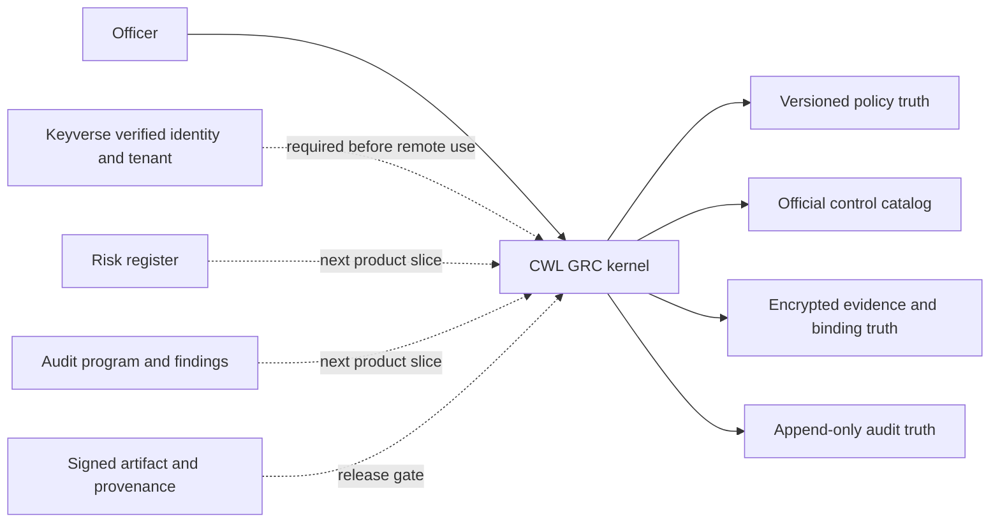

# Product and technical gap baseline

Snapshot: 2026-08-20, Asia/Seoul  
Repository: `ContextualWisdomLab/governance-risk-compliance`  
Baseline source head: `a747077757484c880fccf76e30cac068c593d3b0`

This document is the current product and technical truth baseline. It separates
observed runtime or GitHub evidence from inferred gaps and proposed acceptance
work. A green local test run, a merged pull request, or a readiness manifest is
not a production certification.

## Executive outcome

The repository has a credible first buyer slice: an officer can author an
immutable, versioned policy, map it to seeded official control identifiers,
attach encrypted evidence, and query uncovered controls. The product is not
ready for remote customer use because identity, tenant authorization, key
recovery, release provenance, operational telemetry, risk workflows, and audit
program workflows remain incomplete.

The next buyer-visible action is to connect one verified Keyverse tenant and
actor to the existing policy/evidence workflow, then prove that the same tenant
boundary holds for every read, write, export, audit event, and background job.

## Evidence convention

- **Observed** means reproduced from the current checkout or a current GitHub
  API/check result.
- **Inferred** means a gap derived from the mission, ADRs, issue contracts, or
  the boundary between existing modules; it still needs implementation proof.
- **Proposed** means the smallest acceptance slice to turn the gap into an
  observable product capability.

## Current product contract

| Capability | Observed implementation | Boundary that still matters |
| --- | --- | --- |
| Policy authoring | `policy_document`, immutable `policy_version`, and `policy_control_mapping`; HTTP and CLI paths exist. | No approval/publishing workflow, policy review history, or tenant-backed identity. |
| Official catalogs | CSAP 2026.07, SOC 2 TSC, ISMS-P, ISO/IEC 27001:2022, NIST SP 800-53 Rev. 5, COSO 2013, and COSO 2017 identifiers are seeded. | The catalog is a small checked-in slice, not a source-artifact ingestion and version-diff service. |
| Evidence | Evidence is encrypted at rest, exact operational values remain usable, and evidence binds to official controls. | Rotation, recovery rehearsal, retention, legal hold, purpose-specific exports, and tenant authorization are not complete. |
| Gap query | Latest policy mappings and uncovered catalog controls reuse `control_evidence_binding`. | Risk priority, due dates, ownership, exceptions, and remediation state are not modeled. |
| Integrity | SQLite/PostgreSQL triggers protect audit history and finalized policy history; stale policy writers receive `409 Conflict`. | PostgreSQL lifecycle work is in PR #18 and is not merged at this snapshot. |
| Runtime boundary | The HTTP server is loopback-only; `X-Actor-Id` and `X-Purpose` are explicitly non-authenticating declarations. | No production remote deployment is permitted until Keyverse identity and tenant authorization close the trust boundary. |
| Module boundary | `create_app()` and the `cwl_grc` package support standalone or imported use. | Authenticated versioned service contracts and cross-repository contract tests do not yet exist. |
| Quality | Product workflows require locked dependencies, lint, docstrings, compile, and 100% statement/branch coverage. | Passing quality gates proves code quality for the tested scope, not production readiness or certification. |

Authoritative design decisions are in [ADR 0001](adr/0001-control-evidence-first-slice.md),
[ADR 0002](adr/0002-policy-versioning-official-controls.md), and the doctoring
references. The current implementation is intentionally a modular kernel, not a
monolith that absorbs identity, billing, employment, security scanning, or
other product bodies.

## Buyer-visible gap register

| ID | Priority | Buyer-visible gap | Current evidence | Proposed acceptance slice | Authority |
| --- | --- | --- | --- | --- | --- |
| G-01 | P0 | A customer cannot safely use the product remotely because the caller identity and tenant are not verified. | Local-only boundary in `cwl_grc/remote_access.py`; issue #4; PRs #5, #6, #7, and #16 are the staged Keyverse work. | Verify issuer, audience, token type, signature, actor, tenant, workspace, role, and action scope; enforce the verified context on every read/write/export; add cross-tenant denial tests. | [Issue #4](https://github.com/ContextualWisdomLab/governance-risk-compliance/issues/4) |
| G-02 | P0 | Operators can still encounter ambiguous schema ownership and migration failure modes in a durable PostgreSQL deployment. | Schema lifecycle implementation is in PR #18; exact-head Product previously failed on a test seam and was fixed in commits `514e970`, `97aa541`, and `41dd68f`. | Merge only after fresh exact-head Product, PostgreSQL, SAST, security, and independent review evidence; then document deploy, expand/backfill/contract, rollback, and retry order. | [Issue #8](https://github.com/ContextualWisdomLab/governance-risk-compliance/issues/8) |
| G-03 | P0 | Loss, rotation, or legal hold of an evidence key can make operational evidence unavailable or non-compliant. | PR #20 adds versioned key metadata, explicit old/new key overlap, context and integrity checks, legacy migration, and audited bounded rewrap; PR #21 adds retention metadata and tenant-scoped legal-hold placement/release. Both remain Draft and unmerged. | Add KMS/HSM integration, persistent re-encryption job receipts, recovery rehearsal evidence, retention disposition, and purpose-specific export without destructively masking authorized PII. | [Issue #9](https://github.com/ContextualWisdomLab/governance-risk-compliance/issues/9) |
| G-04 | P0 | A buyer cannot independently verify that a released binary/image came from reviewed source. | No signed release artifact, SBOM, provenance, or protected release workflow is owned here. | Publish digest-pinned artifacts with SBOM, provenance, signature verification, rollback coordinates, and a protected release gate. | [Issue #10](https://github.com/ContextualWisdomLab/governance-risk-compliance/issues/10) |
| G-05 | P0 | Operators lack production readiness, SLO, telemetry, and incident evidence. | `/healthz` is liveness only; no readiness/dependency/latency/error-budget contract exists on `develop`. | Add readiness/startup probes, structured metrics/traces/log fields, SLOs, alert thresholds, incident runbooks, and real failure/recovery tests. | [Issue #11](https://github.com/ContextualWisdomLab/governance-risk-compliance/issues/11) |
| G-06 | P1 | Consumers cannot safely depend on a stable production API or abuse limits. | Local HTTP and CLI contracts exist, but no versioned authenticated contract or rate/size/idempotency policy exists. | Version the API contract, define concurrency/idempotency/size/rate limits, publish error and next-action semantics, and run consumer contract tests. | [Issue #12](https://github.com/ContextualWisdomLab/governance-risk-compliance/issues/12) |
| G-07 | P1 | The product shows coverage gaps but cannot register risk, treatment, residual acceptance, or accountable ownership. | COSO/official control catalogs exist; risk objects and workflows do not. | Add a normalized risk register linked to policy/control/evidence, time-bounded assessments, treatment, residual-risk acceptance, and audit history. | [Issue #13](https://github.com/ContextualWisdomLab/governance-risk-compliance/issues/13) |
| G-08 | P1 | An auditor cannot run a complete audit program from planning through finding closure. | Evidence binding and audit events exist; sampling, findings, remediation, and closure do not. | Add audit program, scope, sample selection, finding, corrective action, due date, verification, and closure workflows with immutable history. | [Issue #14](https://github.com/ContextualWisdomLab/governance-risk-compliance/issues/14) |
| G-09 | P0 | “Ready” is not yet a release authority; readiness evidence is staged but not a production certification. | PR #17 adds a fail-closed readiness manifest and evidence binding; it remains review-required and unmerged. | Validate exact current source, live gate status, evidence freshness, signed artifacts, branch policy, and independent approval; keep `production_ready=false` until all gates are true. | [Issue #15](https://github.com/ContextualWisdomLab/governance-risk-compliance/issues/15) |
| G-10 | P1 | Catalog maintenance can silently drift from current official editions. | Catalog rows are checked into `cwl_grc/catalog.py`; CSAP 2026.07 is pinned to a KISA notice, while NIST’s official page records later Rev. 5 update material. | Add source-artifact metadata, digest, edition, effective date, diff review, deprecation policy, and a catalog refresh check; never invent identifiers. | [Doctoring references](doctoring/REFERENCES.md) |
| G-11 | P1 | A buyer has no first-class risk-to-control-to-evidence dashboard or export tailored to an approved purpose. | Officer HTML states the next evidence action; there is no tenant-scoped dashboard, saved view, or controlled export. | Add authenticated purpose-specific views that omit unrelated fields, preserve exact authorized evidence values, and prove export audit/retention behavior. | ADR 0001; issues #4, #9, #11 |
| G-12 | P1 | Cross-repository consumers cannot rely on a governed contract. | Architecture names Keyverse, Orgmetra, AIS, Billing, naruon, EA, and semantic-data-portal as future consumers only. | Publish minimal HTTP/OpenAPI contracts and contract tests; keep identity, employment, billing, and security-scanner ownership in their source repositories. | [ARCHITECTURE.md](../ARCHITECTURE.md) |

## Current pull-request queue

This is a queue snapshot, not merge approval. Every row requires a fresh exact
head check before any merge. No self-approval, admin merge, force-push, or
predecessor-head evidence is valid.

| PR | Exact head at snapshot | State | Current evidence/action |
| --- | --- | --- | --- |
| [#18](https://github.com/ContextualWisdomLab/governance-risk-compliance/pull/18) | `41dd68f` | Ready, mergeable, blocked | PR #18’s prior Product failure was a test patching the wrong module and then a stale keyless runtime test; both were fixed. Fresh Product/PostgreSQL/security/review checks were pending after the final push. Review exact head and merge only after terminal success and independent approval. |
| [#17](https://github.com/ContextualWisdomLab/governance-risk-compliance/pull/17) | `d42928e` | Ready, mergeable, review-required, blocked | Product, production-readiness, security, and review lanes observed green at snapshot; no independent formal approval was observed. Review the evidence contract and keep its intentionally false readiness result. |
| [#20](https://github.com/ContextualWisdomLab/governance-risk-compliance/pull/20) | `834868d` | Draft, checks pending | First #9 key-lifecycle slice stacked on current #16 head. Local Product gate and PostgreSQL probe passed; keep retention/legal-hold/recovery work open. |
| [#21](https://github.com/ContextualWisdomLab/governance-risk-compliance/pull/21) | `9ddabe8` | Draft, checks pending | Retention metadata and tenant-scoped legal-hold slice stacked on PR #20. Local 100% coverage, PostgreSQL migration/state probe, and Keyverse retention-scope regression passed; keep disposition/recovery work open. |
| [#16](https://github.com/ContextualWisdomLab/governance-risk-compliance/pull/16) | `c1496be` | Draft, mergeable | Parent synchronization preserved current #7 bearer enforcement. Product checks passed locally and remotely; keep stacked behind the verified JWT, OIDC, and route-enforcement sequence. |
| [#7](https://github.com/ContextualWisdomLab/governance-risk-compliance/pull/7) | `ebac50c` | Draft, mergeable | Parent synchronization includes current #6 and #5 security fixes. Product checks passed; review route enforcement against the verified principal and scope contract before advancing. |
| [#6](https://github.com/ContextualWisdomLab/governance-risk-compliance/pull/6) | `887f5c6` | Draft, mergeable | Parent synchronization includes current #5 and exact issuer-whitespace validation. Product checks passed; keep discovery/JWKS loading bounded and pinned. |
| [#5](https://github.com/ContextualWisdomLab/governance-risk-compliance/pull/5) | `0c9c252` | Ready, mergeable, review-required, blocked | Historical Strix run `32336305694` found medium JWT datetime overflow in `nbf`/`iat` skew checks. The shared boundary fix and edge test were pushed as `0c9c252`; fresh Strix and all required checks must be observed on that head. |

GitHub’s branch-protection API returned `404 Branch not protected` for
`develop` during this audit. This is an observed governance gap, not permission
to bypass protection. Confirm the live branch policy through an authorized
organization control plane before merging.

## Technical architecture and ownership gaps

The ownership rule is simple: GRC owns policy, control, risk, evidence, and
compliance-audit truth. Keyverse owns identity and authorization. Central
security workflows own SAST and security scanners. Other CWL products consume
published contracts; they do not write GRC tables. If a future workflow needs a
new domain body, create a separate repository only when the data owner,
deployment boundary, and consumer contract are independently real.

Database acceptance remains 3NF by default. New objects must use at least two
words in `snake_case` (or an explicitly justified equivalent), use official
catalog identifiers, and include a hot-partition strategy before high-volume
event or evidence tables are introduced. No current evidence proves that the
future audit/event workload has been partitioned or load-tested.

## Standards and doctoring actions

The existing doctoring file contains the first-slice APA 7 references for ISO,
AICPA SOC 2 TSC, KISA ISMS-P/CSAP, NIST SP 800-53 Rev. 5, COSO, and OPA. The
2026-08-20 review also confirmed the official NIST page records Rev. 5 update
5.2.0 planning material and that KISA’s 2026.07 CSAP guide was revised on
2026-07-28 without a content change. The NIST update citation is recorded in
[`docs/doctoring/REFERENCES.md`](doctoring/REFERENCES.md); catalog refresh work
must consume the authoritative source artifact, not a search-result summary.

Figma and Storybook are not claimed for this snapshot: the current UI is a
small server-rendered local preview, not a component library project. Before a
customer-facing component system is introduced, create an ADR that records the
Figma file ID, design tokens, Storybook inventory, accessibility checks, button
action edge cases, interaction tests, and i18n consistency checks.

## Verification loop

1. Re-fetch each PR’s exact head and review comments.
2. Fix valid findings at the shared root, with one realistic regression test
   for each non-trivial security, parser, concurrency, or data-integrity rule.
3. Run locked Product, docstring, compile, PostgreSQL, SAST, security, and
   semantic-review checks on that unchanged head.
4. Confirm independent approval and live branch policy; merge only through the
   protected path.
5. After every merge, rebase the next stack only when its ownership boundary is
   still correct, then repeat the exact-head loop.
6. When PRs and issues are empty, select the highest buyer-visible gap above,
   ship its smallest complete slice, and update this baseline, ADRs, doctoring,
   README, and CHANGELOG together.

The repository remains a developer preview until G-01, G-02, G-03, G-04, and
G-05 have production evidence and G-09 is independently certified. No document
in this repository should describe the current state as a production
deployment, compliance certification, or remote-ready service.
