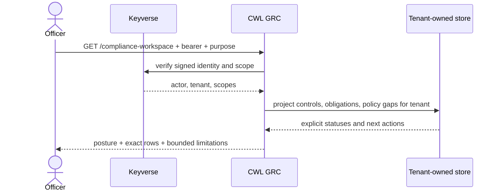

# Compliance workspace read model

## PRD slice

The first authenticated workspace must let an officer answer three questions
for one tenant: what control posture is known, which obligation applicability
decisions need attention, which policy/control mappings remain uncovered, and
which versioned risk assessments require follow-up.
The contract preserves `unknown`, `unassessed`, `stale`, `exception`, and
`ineffective` rather than collapsing them into a pass/fail score.

This slice is read-only and reuses the existing control, obligation, and policy
gap projections, evidence requests, and the bounded risk-register assessment
and disposition projection. Audit programs, controlled exports, and auditor
data rooms remain explicitly out of the projection until their authorization
and provenance contracts are implemented.

## TRD contract

`GET /compliance-workspace` requires the `compliance_governance` purpose. In
Keyverse mode it requires a signed principal with the `grc.compliance.read`
scope; tenant identity comes only from the verified `org` claim. The loopback
developer preview keeps its existing `local_development` compatibility tenant.

The response contains:

- `posture`: distinct obligation counts plus work-item counts by control
  coverage, obligation applicability, review queue, and policy gaps; the
  `risk_portfolio` member contains tenant-scoped risk indicators and status/
  category breakdowns;
- `controls`: every official catalog control with its conservative coverage
  status and next action;
- `obligations`: same-tenant source-backed obligations with scope,
  applicability, review date, queue, and next action;
- `policy_gaps`: same-tenant latest policy mappings without an effective or
  authorized not-applicable conclusion;
- `evidence_requests`: metadata-only request state, scope, period, and audit
  history without evidence payloads;
- `risks`: stable tenant risk identities with immutable inherent/residual
  assessment snapshots, versioned treatment plans, independent time-bounded
  acceptances, independent closure approvals, and explicit appetite status;
- `next_actions`: deterministic references into the projected work items;
- `not_yet_projected`: explicit follow-up areas, never presented as empty
  audit state.

The route does not expose evidence payloads, source legal text, tenant/actor
identifiers, or an invented risk score. Risk scores are only calculated from a
versioned methodology and explicit same-tenant internal-control test/evidence
links; treatment, acceptance, and closure records are returned only as their bounded
metadata projections. Applicability and review-queue counts
are explicitly work-item counts because one obligation can have several active
scope decisions. A customer-facing UI must render the
exact rows behind every count and provide a keyboard-accessible empty/loading/
error state; the Figma/Storybook buyer-workspace authority remains PR34.
Risk portfolio indicators are read-only counts, not a cross-methodology risk
score: active acceptance counts require the latest assessment and valid period,
and overdue counts exclude closed risks.

## UML

## Acceptance and ceiling

Two verified tenant tokens receive only their own obligations and policy gaps;
the wrong scope is denied. The route is a local-preview contract, not a
production deployment or compliance conclusion. Adding evidence freshness,
audit, exports, or data-room projections requires a separate
reviewed contract with purpose-specific field selection, audit, retention, and
reproducibility evidence.
