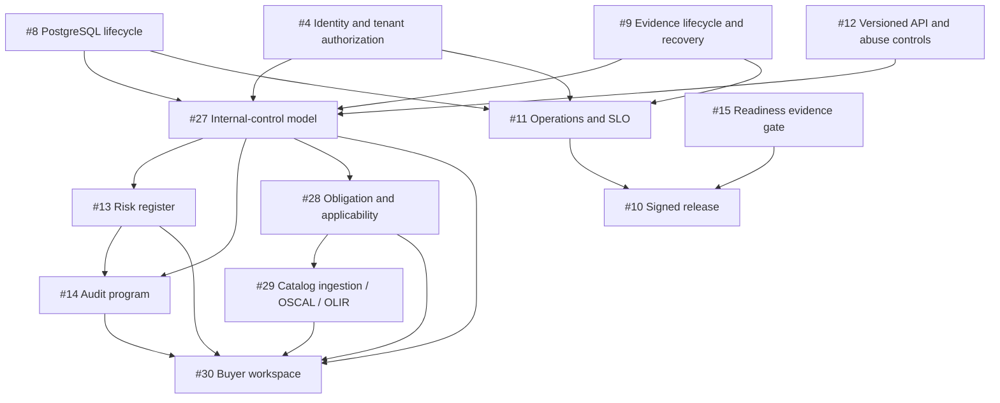

# GRC domain completion roadmap

- Status: Proposed product baseline
- Snapshot date: 2026-08-20
- Repository: `ContextualWisdomLab/governance-risk-compliance`
- Related ADR: `docs/adr/0011-separate-external-requirements-and-internal-controls.md`
- Related issues: #4, #8–#15, #27–#30

## Product outcome

CWL GRC is complete only when it can preserve and explain the full decision loop:

```text
authoritative source
→ compliance obligation and applicability decision
→ external requirement
→ approved policy
→ internal-control definition
→ deployed control implementation
→ control test and evidence usage
→ effectiveness conclusion
→ risk / finding / deficiency / exception
→ remediation and independent retest
→ closure or time-bounded risk acceptance
→ officer report and controlled export
```

A policy document, catalog row, evidence artifact, green test workflow, or high
posture score is not by itself proof of compliance or control effectiveness.
Every officer-facing conclusion must be traceable to its authority, scope, time,
method, evidence, review decision, and current limitation.

## Product truth boundaries

| Truth | Owning boundary |
| --- | --- |
| Identity, OIDC, SCIM, service principals | Keyverse |
| Laws, regulations, contracts, official framework publications | External authoritative publishers and parties |
| Applicability, policy, internal control, risk, GRC audit, evidence usage | CWL GRC |
| People and employment | Orgmetra |
| Applications, capabilities, technologies, transformation | Enterprise Architecture Core |
| Data assets, glossary, lineage, data products | Semantic Data Portal |
| Billing and commercial entitlement | Billing Control Plane |
| Security scanners and organization-wide CI gates | CWL Security and central `.github` |
| Inferred lineage or AI proposals | Their producing service, always `inferred` or `proposed` until reviewed |

Peer products use versioned contracts and immutable references. They do not
write GRC tables or become alternate GRC systems of record.

## Canonical domain layers

### 1. Authoritative source and obligation

```text
regulatory_source
source_revision
compliance_obligation
obligation_requirement
jurisdiction_record
applicability_rule
applicability_decision
legal_interpretation
compliance_commitment
regulatory_change
change_impact_assessment
```

This layer answers what source applies, to which scope, under whose authority,
for which effective period, and when it must be reviewed again. `not_applicable`
is an authorized, evidenced, versioned decision—not deletion.

### 2. External requirement catalog

```text
source_artifact
source_artifact_version
source_license_policy
catalog_import_run
catalog_import_receipt
catalog_release
control_framework
control_item
requirement_change_record
mapping_collection
requirement_mapping
mapping_review_record
```

External requirements preserve exact edition and source provenance. Licensed or
copyrighted text is stored and exported only when the applicable policy permits
it. An identifier-only source never becomes a full-text public export.

### 3. Policy

```text
policy_document
policy_version
policy_control_mapping
policy_approval_record
policy_publication_record
policy_review_obligation
```

The current immutable policy-version model remains valid. Completion requires
approval, publication, effective-period, review, retirement, and applicability
links without rewriting historical editions.

### 4. Internal control

```text
control_objective
internal_control_definition
control_definition_version
control_implementation
control_owner_assignment
control_requirement_mapping
control_test_plan
control_test_execution
control_test_result
control_exception
control_deficiency
evidence_usage
```

External requirements are criteria; internal controls are organization-designed
responses. An implementation is scoped to an application, process, organization,
data asset, provider, or inherited service boundary. Evidence presence does not
prove design or operating effectiveness.

### 5. Evidence lifecycle

```text
evidence_record
evidence_request
evidence_submission
evidence_review_record
evidence_usage
retention_class
legal_hold_record
disposition_record
export_record
export_download_event
key_rotation_job
rewrap_job_receipt
recovery_rehearsal
```

Evidence keeps exact values required by authorized work. The product limits
field disclosure by tenant, purpose, role, scope, and approved export—not by
destructively changing the authoritative artifact.

### 6. Risk

```text
risk_register
risk_scenario
risk_methodology
risk_assessment
risk_appetite
risk_tolerance
risk_treatment
risk_acceptance
risk_review
risk_indicator
```

Residual risk consumes reviewed control-implementation and test truth. External
requirement mappings must not multiply mitigation effects. Every methodology
version preserves deterministic calculations, assumptions, rounding, authority,
and historical results.

### 7. Audit and remediation

```text
audit_universe
audit_program
audit_engagement
audit_scope
audit_criterion
audit_procedure
audit_sample
audit_workpaper
audit_finding
management_response
remediation_plan
remediation_action
retest_record
finding_closure
auditor_competence
independence_declaration
quality_assessment
```

`audit_event` remains the append-only application action log. It is not an audit
engagement or finding. Audit criteria may be external requirements or applicable
obligations, while the tested object is the actual internal-control implementation.

Risk treatments, control deficiencies, policy exceptions, audit findings, and
other sources should reuse a common remediation workflow where the action,
owner, due date, evidence, verification, and closure authority are truly shared.

### 8. Buyer workspace and reporting

```text
saved_view
evidence_request
report_definition
report_generation
export_record
data_room_package
data_room_grant
posture_projection
```

Dashboards and reports are projections. Each chart, percentage, and status must
have an exact-value table and trace back to authoritative rows, source versions,
filters, knowledge cutoff, and authorization decision.

## Dependency graph



Dependencies express semantic prerequisites, not permission to reuse stale
check results. Every changed exact head requires its own terminal-success checks
and independent review.

## Delivery sequence

### Wave 0 — Production foundation

1. Merge the live Keyverse stack in order: #38 → #55 → #56 → #57 → #58.
   Closed PR #5 is superseded by #38. Closed PRs #6, #7, and #16 are
   stack-only history and did not update protected `develop`.
2. Complete #8 PostgreSQL lifecycle and exact-head integration evidence.
3. Complete #9 key lifecycle, retention, legal hold, backup, restore, and
   purpose-specific disclosure.
4. Complete #11 probes, telemetry, SLO, paging, and runbooks.
5. Complete #12 versioned API, idempotency, pagination, concurrency, and bounded
   input/output behavior.
6. Merge #15 readiness evidence gate while keeping `production_ready=false`
   until every live release gate is independently evidenced.
7. Complete #10 signed immutable artifact, SBOM, provenance, protected promotion,
   rollback, and revocation.

### Wave 1 — Internal-control foundation

Implement #27 before risk or audit domain logic:

1. Add internal-control definitions and immutable versions.
2. Add scoped control implementations and owner assignments.
3. Add reviewed many-to-many requirement mappings.
4. Add test plans, executions, design/operating-effectiveness results,
   deficiencies, exceptions, and evidence usage.
5. Migrate first-slice direct evidence bindings as `unassessed` compatibility
   records without inventing controls or effectiveness conclusions. The
   stable legacy key is `binding_id` plus `control_item_id`. First-slice
   `control_evidence_binding` rows do not store `requirement_mapping_id`;
   tenant scope is the bound evidence record's tenant after Keyverse tenant
   persistence, otherwise the local-development tenant. The compatibility
   projection never invents a mapping. Until an authorized current
   `control_requirement_mapping` exists for that tenant and control, the
   binding projects as `unassessed` at the control-item grain and is excluded
   from requirement-mapping posture. After such mappings exist, the same
   binding fans out as `unassessed` to each current authorized mapping for
   that tenant and `control_item`, recording `legacy_binding_id` as the input
   fact identifier under `posture-projection-v1`.
6. Replace the old binary covered/uncovered projection with explicit status:
   `unknown`, `unassessed`, `implemented_not_tested`, `design_effective`,
   `operating_effective`, `ineffective`, `exception`, `stale`, and
   `not_applicable` where authorized.

The status projection is not a mutually exclusive source-of-truth enum.
Implementation state, effectiveness result, evidence freshness, exception or
deficiency state, and applicability decision remain separate versioned facts.
The compatibility projection reads the latest authorized facts for the same
tenant, requirement mapping, and as-of time, and recalculates when one of those
facts changes. If one display token is required, precedence is:
`not_applicable` only when the authorized applicability decision result is
exactly `not_applicable`; `exception` for an active accepted exception;
`stale` for expired evidence; `ineffective` for a current failed effectiveness
result; `operating_effective` for a current passed operating test;
`design_effective` for a current passed design test; `implemented_not_tested`
for an implementation without a current test; `unassessed` for a legacy or
present evidence link without an assessment; and `unknown` when an authorized
applicability result is `applicable` but no implementation or evidence fact
exists, or when no authoritative applicability, implementation, or evidence
fact exists. Applicability facts and the `not_applicable` display token are
validated separately. The projection records `projection_rule_version`
(`posture-projection-v1`), input fact versions and identifiers, as-of time, and
recalculation event so history is reproducible after rule changes.

### Wave 2 — Obligation and catalog intelligence

1. Implement #28 obligation register, applicability decisions, commitments, and
   regulatory-change impact.
2. Implement #29 source-artifact governance, release diffs, license controls,
   OSCAL Catalog/Profile/Mapping exchange, and OLIR ingestion.
3. Link source changes to affected policies, controls, risk assessments, audit
   criteria, evidence requests, and reports without mutating them automatically.

### Wave 3 — Risk and audit

1. Implement #13 risk methodology, assessments, treatment, acceptance, review,
   and indicators using #27 effectiveness truth.
2. Implement #14 audit universe, programs, engagements, sampling, workpapers,
   findings, remediation, independent retest, closure, competence, independence,
   supervision, and quality assessment.
3. Reuse evidence and remediation bodies; do not create parallel plaintext
   evidence stores or duplicate corrective actions for every source type.

### Wave 4 — Buyer workspace

Implement #30 after the underlying truths exist:

1. Compliance posture and next-action workspace.
2. Obligation → requirement → policy → internal control → implementation → test
   → evidence trace.
3. Evidence requests, review, freshness, retention, legal hold, and reuse.
4. Risk, finding, deficiency, exception, and remediation queues.
5. Purpose-limited CSV/JSON/PDF exports and external-auditor data rooms.
6. Figma file ID in ADR, design tokens, Storybook inventory, WCAG 2.2 AA,
   keyboard/touch interactions, exact-value tables, print behavior, and i18n.

### Wave 5 — Enterprise profiles

Only after the canonical model is stable, add profile modules for:

- AI governance and AI management systems;
- privacy management;
- business continuity;
- third-party and supply-chain risk;
- cloud shared responsibility;
- continuous controls monitoring; and
- data-management capability evidence.

Profiles map to the canonical obligation, control, evidence, risk, audit, and
remediation model. They do not create separate GRC silos.

## Database rules

- All new database objects use at least two-word `snake_case` names.
- Transactional objects meet 3NF unless an ADR proves a deliberate read-model
  exception.
- Tenant-owned parent/child relations have database-level tenant consistency.
- Published facts and decisions are immutable or superseded; hard delete is not
  used to rewrite history.
- Business valid time and system recorded time remain distinct where historical
  reconstruction matters.
- High-volume `audit_event`, evidence-usage, telemetry, and workflow tables need
  a partition and index strategy before production scale is claimed.
- Raw provider, source, or standard payloads do not become JSONB business-rule
  stores. They remain evidence; normalized fields drive decisions.

## API and event rules

- API contracts are versioned and reject unknown/ambiguous fields before side
  effects.
- Mutations use tenant/principal/action-scoped idempotency keys.
- Mutable resources use explicit optimistic concurrency and HTTP preconditions.
- Errors follow RFC 9457 with stable machine codes and no secret, plaintext
  evidence, stack trace, or unauthorized object disclosure.
- Collections use deterministic bounded cursor pagination.
- Cross-product events contain opaque references, tenant, purpose, occurrence
  and recording times, correlation/causation, provenance, and schema version.
- Events and API responses never elevate an inferred or proposed relationship to
  authoritative truth without an approved transition.

## Release gates

A release candidate is not production-ready until all applicable gates below are
current on the exact artifact:

### Product accuracy

- The complete officer loop works end to end.
- Evidence presence and control effectiveness remain distinguishable.
- The complete display-token set—`unknown`, `stale`, `unassessed`,
  `not_applicable`, `implemented_not_tested`, `design_effective`,
  `operating_effective`, `ineffective`, and `exception`—remains
  distinguishable. The Applicability fact is validated separately, and
  `not_applicable` is emitted only for an authorized decision whose result is
  exactly `not_applicable`; an authorized `applicable` result without
  implementation or evidence is `unknown`.
- Risk, finding, deficiency, exception, remediation, retest, and acceptance
  state transitions are deterministic and historically reproducible.

### Security and tenancy

- Keyverse signature, issuer, audience, token type, client, role, scope, tenant,
  actor, and purpose are enforced.
- Cross-tenant direct SQL, guessed references, exports, background jobs, caches,
  saved views, and data-room access fail closed.
- Exact operational PII remains available only to an authorized purpose and is
  not copied to logs, traces, events, or unrelated exports.

### Data and recovery

- PostgreSQL clean install and every supported upgrade path pass.
- Backup, point-in-time restore, key recovery, tenant isolation, history,
  bindings, and artifact integrity are rehearsed against realistic data.
- Hot-partition and large-tenant workloads have measured capacity evidence.

### Quality

- Production statement coverage: 100%.
- Production branch coverage: 100%.
- Public API docstrings: 100%.
- Property, fuzz, concurrency, authorization, migration, PostgreSQL integration,
  accessibility, i18n, and officer-journey end-to-end tests pass.
- Skipped or ignored required tests are release failures.

### Supply chain and operation

- Exact-head Product, PostgreSQL, SAST, Security, semantic review, and live
  branch-policy requirements are terminal-success.
- OCI/wheel artifacts are immutable, signed, SBOM-attested, provenance-backed,
  vulnerability-evaluated, and promoted by digest without rebuilding.
- Readiness, drain, telemetry, SLO, alerts, paging, incident, rollback, restore,
  and revocation runbooks have rehearsal evidence.

### Product integrity

- The product never claims SOC 2, ISO, CSAP, ISMS-P, OSCAL, or other
  certification merely because identifiers, mappings, or adapters exist.
- Licensed standard text is not redistributed without permission.
- LLM or automated proposals do not approve obligations, mappings, risk
  acceptance, audit closure, evidence sufficiency, or certification.
- A readiness manifest is an evidence register, not self-certification.

## Definition of commercial completion

The product is commercially complete when an authorized officer can:

1. register or import an authoritative source and exact release;
2. decide and review applicability for a precise tenant and scope;
3. approve a policy and reviewed internal-control design;
4. record each implementation, owner, expected evidence, and test obligation;
5. collect and review purpose-bound evidence without losing exact values;
6. conclude design and operating effectiveness with limitations;
7. calculate and govern risk, treatment, and time-bounded acceptance;
8. plan and execute an independent audit, finding, remediation, retest, and
   closure workflow;
9. see a truthful role-specific posture and next action;
10. create accessible, controlled, reproducible exports for an auditor or board;
11. reconstruct every decision from source, authority, time, method, evidence,
    and immutable history; and
12. deploy, operate, recover, upgrade, roll back, and revoke a signed artifact
    through protected exact-head gates.

Until those conditions have current evidence, the repository remains a
production-oriented GRC kernel rather than a completed enterprise GRC platform.
