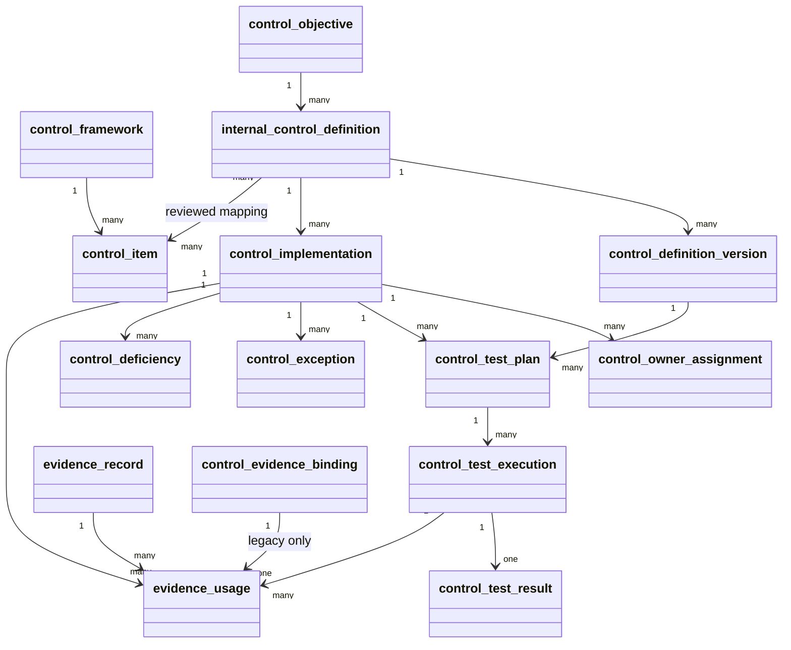

# Internal-control model PRD / TRD / UML

## PRD: buyer outcome

The compliance officer must be able to answer, for each official requirement:

> Which reviewed internal control implements this requirement, in what scope,
> who owns it, which design and operating tests were run, what evidence was
> used, and what is the next action?

The product must not answer “effective” merely because an evidence artifact was
attached. The first buyer slice is a local developer preview; Keyverse-backed
identity, tenant authorization, stable external APIs, exports, and the tenant
workspace remain separate delivery gates.

### In scope

- official external catalog references;
- tenant-owned control objectives, definitions, immutable versions, scoped
  implementations, and temporal owners;
- reviewed many-to-many mappings;
- design/operating test plans, executions, results, exceptions, deficiencies,
  and purpose-approved evidence usage;
- explicit coverage statuses and next actions;
- additive legacy migration to `unassessed`.

### Out of scope

- copying CSAP, SOC 2, ISMS-P, or other official control text into tenant data;
- residual-risk scoring, regulatory obligations, or audit opinion generation;
- production identity, remote exposure, export authorization, or a new UI
  component system;
- asserting that a PR merge or green local check is a production deployment.

## TRD: relational and runtime contract

All owned tables use two-or-more-word `snake_case` names, 3NF, non-null
`tenant_id`, temporal validity where a fact can change, and composite tenant/
parent foreign keys. Published control definition versions, reviewed mappings,
test executions/results, and evidence usage are immutable. The database guards
must reject cross-tenant references in both SQLite and PostgreSQL.

The kernel workflow is:

1. create a published reusable definition and scoped implementation;
2. approve one or more official catalog mappings;
3. create design and/or operating test plans;
4. record a dated execution and one immutable result;
5. bind evidence to the exact implementation and completed execution only when
   the evidence collection date is inside the test period;
6. project the conservative status and next action.

`control_coverage_status()` is the single projection used by catalog coverage
and policy gaps. Legacy `control_evidence_binding` rows project to
`unassessed`. `ineffective` takes priority over positive results;
time-bounded exceptions, stale operating conclusions, design-only conclusions,
and authorized N/A remain distinct.

## UML / relationship map

The graph is a provenance model, not an assertion that an absent edge means
“no relationship.” Each mapping has a reviewed relation and validity period.

## Research and standards basis

COSO (2013) supplies the internal-control design context. OSCAL Control Mapping
Model v1.2.3 supplies the machine-readable crosswalk vocabulary and provenance
shape. The implementation uses the product’s official catalog identifiers and
keeps source URLs and citations in `docs/doctoring/REFERENCES.md`.

## Acceptance evidence

The acceptance suite requires 100% statement and branch coverage and 100%
production docstring coverage. Local acceptance evidence also includes a real
PostgreSQL 18 upgrade/runtime probe; Product CI currently runs the locked
Python checks without provisioning PostgreSQL. A future release must attach
authenticated tenant authorization, CI or release automation for the
PostgreSQL probe, production migration, load/partition evidence, and export
acceptance before changing the local-preview status.
