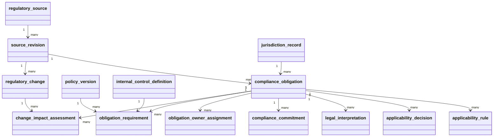

# Obligation and applicability PRD / TRD / UML

## PRD: buyer outcome

An authorized compliance officer can register an authoritative source and exact
edition, create an obligation for a precise tenant scope, record an evidenced
applicability decision, propose a policy or internal-control link for independent
review, and triage a later source change without losing history.

### In scope

- `regulatory_source`, `source_revision`, `compliance_obligation`, and
  `jurisdiction_record` references;
- `applicability_rule`, immutable `applicability_decision`, and
  `legal_interpretation` history;
- separate contractual/voluntary `compliance_commitment` records and temporal
  `obligation_owner_assignment` records;
- proposed `obligation_requirement` links to finalized policy revisions and
  internal controls/implementations;
- `regulatory_change`, immutable impact assessment, overdue/upcoming worklist,
  and local JSON officer routes.

### Out of scope

- legal advice, copied legal/standard text, certification, or automatic legal
  applicability inference;
- production Keyverse deployment, risk scoring, audit engagement, exports, or
  a customer workspace component system;
- automatic mutation of approved policies, controls, or applicability history
  after a source revision.

## TRD: relational and runtime contract

Every owned row is tenant-scoped and uses two-or-more-word `snake_case` names.
Source editions, obligations, applicability decisions, requirement links,
regulatory changes, and impact assessments are append-only. Composite foreign
keys pair every tenant with its parent identifier. Source and legal bodies stay
external references; license classification controls whether an immutable
artifact reference is available.

The workflow is:

```text
source pointer → exact revision → obligation + scope
→ applicability rule/decision + evidence + review date
→ proposed policy/internal-control link → independent review
→ source change + diff reference → impact owner/plan/re-approval
```

Controlled applicability states are `applicable`, `not_applicable`,
`partially_applicable`, `inherited`, `compensating_control`, `pending_review`,
and `unknown`. A `not_applicable` decision requires rationale, evidence
reference, effective period, and next review. The worklist returns `overdue`,
`upcoming`, or `none` based on the latest decision for the tenant; its
`upcoming_days` horizon is an integer from 0 through 3660.

## UML / relationship map



`obligation_requirement` is an append-only proposed relationship row; creation
does not self-approve it or turn a policy or control into proof that the
obligation is satisfied. The internal
control coverage projection remains the authority for design/operating
effectiveness.

## Research and standards basis

- ISO 37301:2021 defines the compliance-management-system baseline for
  establishing, implementing, evaluating, maintaining, and improving a
  compliance management system.
- ISO 37301:2021/Amd 1:2024 is retained as a current published amendment and
  climate-action change input.
- External statutory, regulatory, contractual, and voluntary sources remain
  authoritative. The product stores references, decisions, mappings, and
  evidence rather than reproducing protected content.

## Acceptance evidence

- realistic jurisdiction, contract, partial-applicability, supersession,
  late-change, and cross-tenant scenarios pass;
- source and decision history is database-immutable in SQLite and PostgreSQL;
- exact source digest and diff references are retained;
- local tests maintain 100% production statement/branch coverage and public
  docstrings;
- protected reads use Keyverse tenant identity when configured, while the
  runtime remains loopback-only until the production identity boundary exists.
